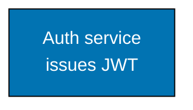
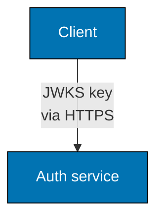

# Common Mermaid Syntax Errors: Label Constraints — Overview, Rule 1, and Rule 2

**CRITICAL**: Mermaid renderers silently clip label text beyond approximately 20–22 characters with no warning. Edge labels accept `<br/>` and no other HTML. URL paths and dot-prefixed tokens in edge labels break the parser.

These three constraints apply everywhere labels appear and are documented together because they all stem from the same root problem: edge labels and node label lines have tight rendering limits and restricted syntax.

## Rule 1: Node label line breaks — `<br/>` only

Use `<br/>` to create line breaks inside node labels. The `\n` escape sequence renders as the literal characters `\n` (see Error 7). `<br/>` is the only supported mechanism.

**DO:**



**DO NOT:**

```text
graph TD
    A["Auth service\nissues JWT"]:::blue
    %% BROKEN: renders as "Auth service\nissues JWT" (literal backslash-n)
    classDef blue fill:#0173B2,stroke:#000000,color:#FFFFFF
```

## Rule 2: Edge labels — `<br/>` breaks, no other HTML

Edge labels are the text inside `|"..."|` arrow syntax: `A -->|"text"| B`. Split a long edge label with `<br/>` so each segment stays within the 20-grapheme limit; use no other HTML. This supersedes the earlier plain-text-only rule, written when GitHub rendered edge-label `<br/>` as literal text. GitHub's Mermaid v11 renders it as a line break (a rendering regression was fixed in August 2026). Visually confirm the rendered diagram, per the [render-fidelity caveat](./mermaid-render-fidelity-caveat.md).

**DO:**



**DO NOT:**

```text
graph TD
    A[Client]-->|"JWKS key fetched via HTTPS"| B[Auth service]
    %% BROKEN: a 26-character single-line edge label clips on GitHub
    %% ALSO BROKEN: HTML other than <br/>, such as <b>, is not guaranteed to render
```

Keep edge labels short text with at most `<br/>` breaks. If the detail still does not fit, move it into the destination node label.
