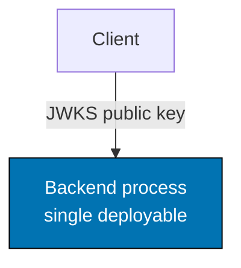
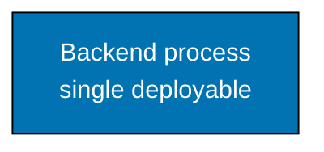

# Common Mermaid Syntax Errors: Label Constraints — Rule 3, Maximum Line Length

Both node label lines (each segment between `<br/>` tags) and edge label strings must not exceed **20 characters**. Most Mermaid renderers clip text beyond approximately 20–22 characters with no error or warning.

Count every character including spaces, colons, slashes, and Unicode.

**Enforcement**: none — Rule 3 is a convention that no gate enforces; authors count and reviewers check. The `md-mermaid` registry gate fails only on labels longer than the **30**-grapheme limit declared in `repo-config.yml` `policies.markdown.mermaid` (`node-label-graphemes`, `edge-label-graphemes`) — a backstop rather than this rule — and `./rhino md mermaid validate` has no option to lower that limit. A green `md-mermaid` run does not prove Rule 3 compliance.

**Safe examples (≤20 chars):**

| Text                 | Length |
| -------------------- | ------ |
| `"Auth and profile"` | 16     |
| `"health check"`     | 12     |
| `"JWKS public key"`  | 15     |
| `"issues JWT"`       | 10     |

**Unsafe examples (>20 chars — will be clipped):**

| Text                                  | Length | Clipped rendering          |
| ------------------------------------- | ------ | -------------------------- |
| `"Single deployable backend process"` | 34     | `"Single deployable back"` |
| `"HTTPS: fetch JWKS public key"`      | 28     | `"HTTPS: fetch JWKS publ"` |
| `"GET /.well-known/jwks.json"`        | 26     | cut at `.well-known`       |

**DO:**



**DO NOT:**

```text
graph TD
    A["Single deployable<br/>backend process"]:::blue
    %% BROKEN: "Single deployable backend process" is 34 chars — clipped
    B[Client]-->|"HTTPS: fetch JWKS public key"| A
    %% BROKEN: "HTTPS: fetch JWKS public key" is 28 chars — clipped
    classDef blue fill:#0173B2,stroke:#000000,color:#FFFFFF
```

**Technique**: Split long phrases across two `<br/>` segments, each ≤20 chars.


