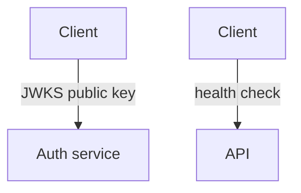
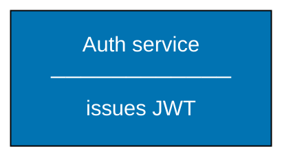

# Common Mermaid Syntax Errors: Label Constraints — Rules 4 and 5

## Rule 4: No URL paths or dot-prefixed tokens in edge labels

Any token starting with `.` inside an edge label (for example `/.well-known/`, `./path`, or `.json`) breaks the Mermaid parser. Mermaid interprets a leading `.` as the start of a CSS class selector, causing a parse failure.

Describe the action in plain words instead of quoting a URL path.

**DO:**



**DO NOT:**

```text
graph TD
    A[Client]-->|"GET /.well-known/jwks.json"| B[Auth service]
    %% BROKEN: "." in "/.well-known" is parsed as CSS class selector
    C[Client]-->|"POST /api/v1/auth/register"| D[API]
    %% BROKEN AND too long (>20 chars)
```

URL paths belong in node label boxes (where HTML renders correctly), not on arrows.

## Rule 5: Keep separator lines proportional

Separator characters like `────────────────────` set the minimum node width. Make them match the longest text line in the node label, keeping that longest line at ≤20 characters.

**DO:**



**DO NOT:**

```text
graph TD
    A["Auth service<br/>────────────────────────────<br/>issues JWT"]:::blue
    %% BROKEN: separator (28 dashes) forces node wider than text lines,
    %% which causes adjacent text to be clipped
    classDef blue fill:#0173B2,stroke:#000000,color:#FFFFFF
```
