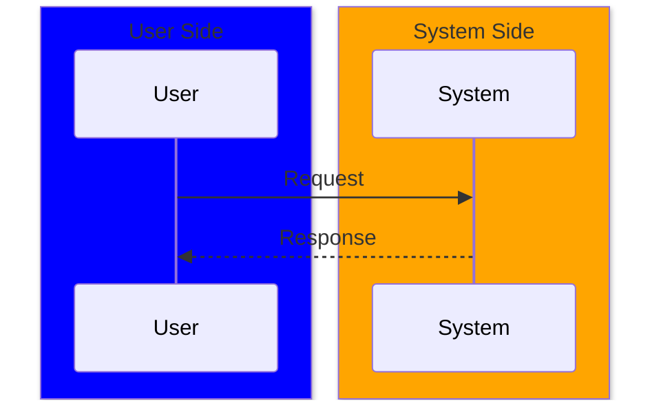
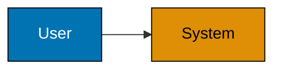
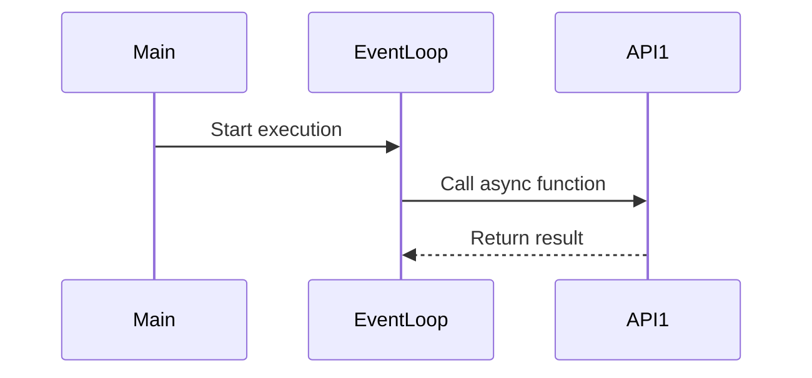
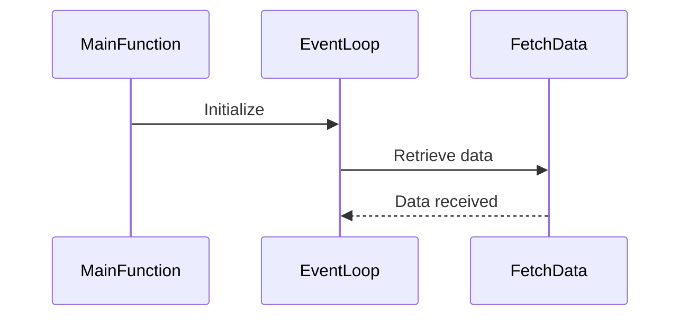

# Common Mermaid Syntax Errors: Style Commands and Sequence-Diagram Participant Syntax

## Error 4: Style Commands in Sequence Diagrams

**CRITICAL**: The `style` command only works in `graph`/`flowchart` diagrams, NOT in `sequenceDiagram`.

**Problem Example (FAIL: BROKEN):**

```text
sequenceDiagram
    participant User
    participant System

    User->>System: Request
    System-->>User: Response

    style User fill:#0173B2           %% ERROR: style not supported in sequence diagrams
    style System fill:#DE8F05         %% ERROR: style not supported in sequence diagrams
```

**Solution (PASS: WORKING):**

For sequence diagrams, use `box` syntax for grouping and coloring instead:



**Alternative: Use graph/flowchart for styled diagrams:**



**Rationale**: Mermaid diagram types have different syntax capabilities. `style` commands are only valid in graph-based diagrams (graph, flowchart), not in interaction diagrams (sequenceDiagram, classDiagram, stateDiagram).

**Real-World Example Fixed:**

- Python intermediate Example 33 (context manager): Removed `style` commands from sequence diagram

## Error 5: Sequence Diagram Participant Syntax with "as" Keyword

**CRITICAL**: Using `participant X as "Display Name"` syntax with quotes in sequence diagrams causes rendering failures in some Mermaid environments.

**Problem Example (FAIL: BROKEN)**:

```text
sequenceDiagram
    participant Main as "main()"
    participant Loop as "Event Loop"
    participant F1 as "fetch_data(api1)"

    Main->>Loop: Start execution
    Loop->>F1: Call async function
    F1-->>Loop: Return result
```

**Why it fails**: Some Mermaid renderers struggle with complex display names containing spaces, parentheses, or special characters when combined with the `as` keyword and quotes. This syntax pattern causes parsing errors.

**Solution (PASS: WORKING)**:

Use simple participant identifiers without the `as` keyword:



**Alternative - Descriptive names without quotes**:

If you need descriptive names, use CamelCase or underscores without the `as` keyword:



**Rule**: In sequence diagrams, use simple participant identifiers. Avoid the `as` keyword with quoted display names. Use CamelCase or simple names instead of quoted strings with spaces or special characters.

**Rationale**:

- Simple participant syntax is the canonical example in Mermaid documentation
- Complex display names with `as` keyword and quotes cause parsing errors in some renderers
- Simple identifiers are more reliable across different Mermaid versions and rendering contexts

**Affected diagram types**: `sequenceDiagram` only (not `graph`/`flowchart`)

**Real-World Examples Fixed:**

- Python intermediate Example 33 (async/await): Changed `participant Main as "main()"` to `participant Main`
- Elixir advanced Example 62 (GenServer): Changed `participant Client as "Client Process"` to `participant Client`
