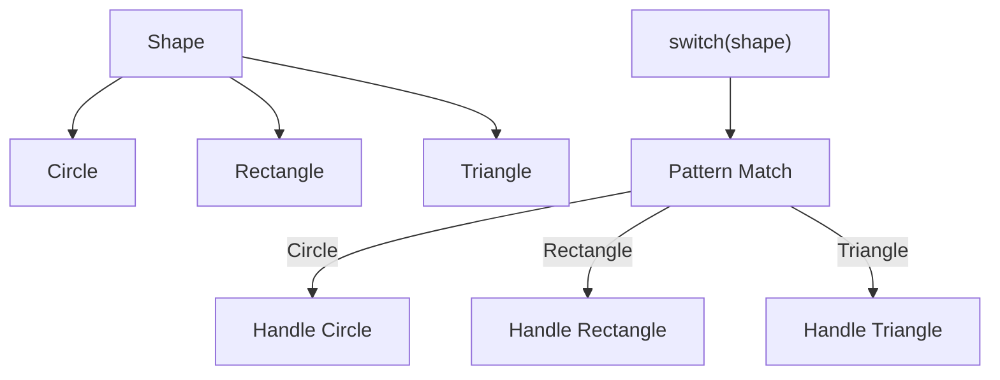
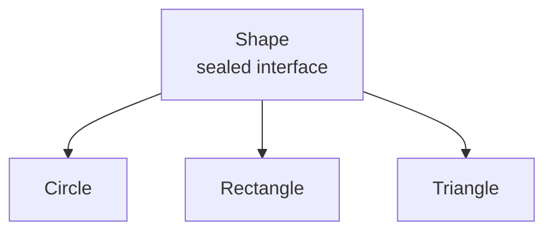
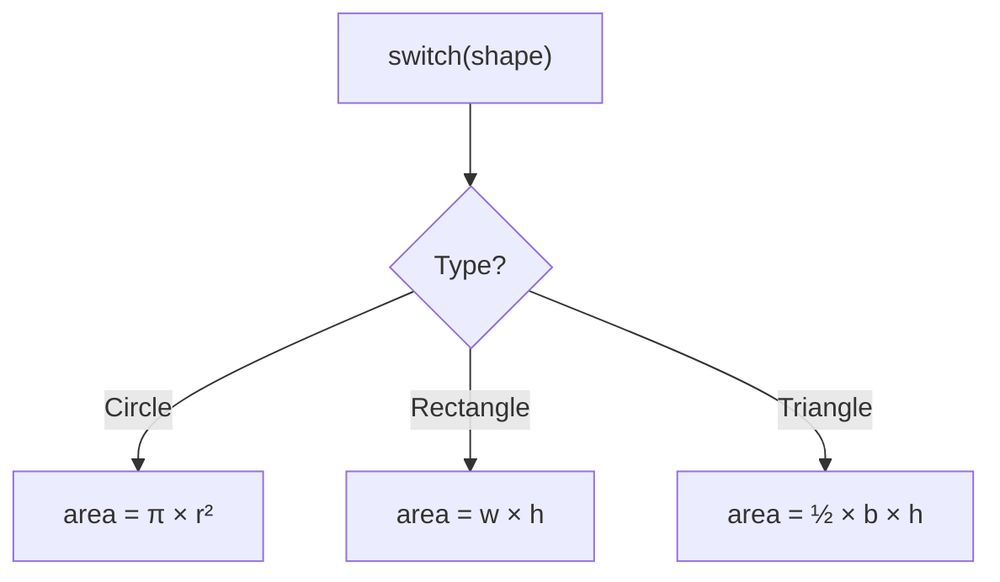
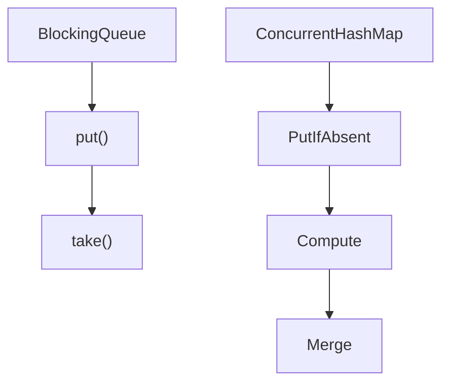
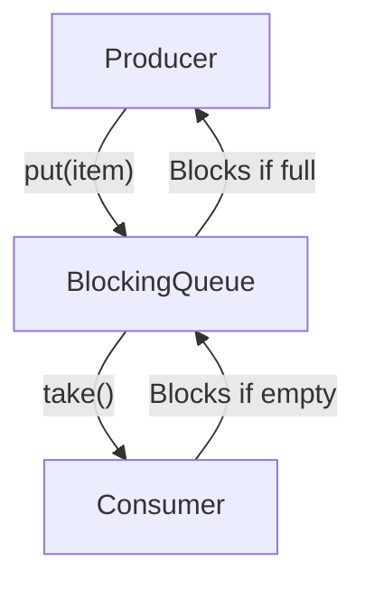
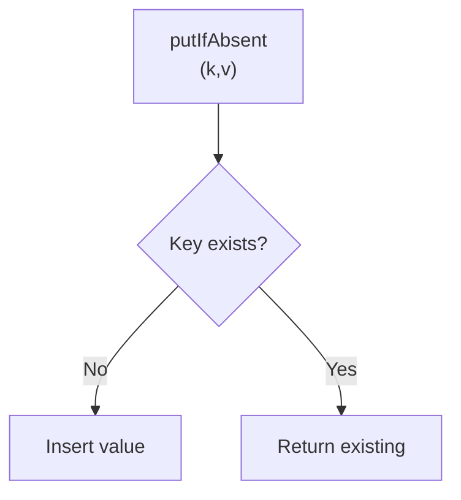

# Diagram Size and Splitting: Real-World Fixes and Summary

## Real-World Fixes

**Example 1: Sealed Classes (Before)**

Combined hierarchy + pattern matching:

**Example 1: Sealed Classes (After)**

**Sealed Class Hierarchy:**

**Pattern Matching Switch:**

**Example 2: Concurrent Collections (Before)**

Combined BlockingQueue + ConcurrentHashMap:

**Example 2: Concurrent Collections (After)**

**BlockingQueue (Producer-Consumer):**

**ConcurrentHashMap (Atomic Operations):**

## Summary

**Golden Rules**:

1. **One concept per diagram** - Each diagram explains one idea
2. **Limit branching** - Maximum 3-4 branches per level
3. **No subgraphs** - Use separate diagrams with headers instead
4. **Descriptive headers** - Add `**Concept Name:**` above each diagram
5. **Mobile-first** - Ensure readability on narrow screens

This prevents "too small" diagram issues and improves mobile user experience.
