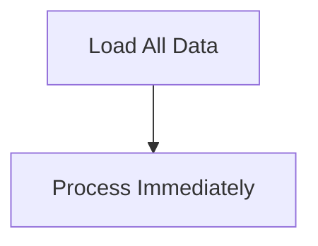
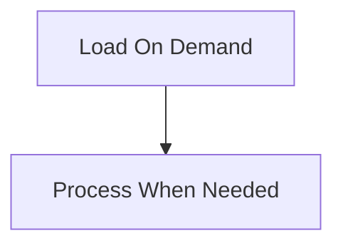

# Diagram Size and Splitting: Splitting Guidelines

**1. One Concept Per Diagram**

FAIL: **Bad** (multiple concepts):

- "Sealed classes + Pattern matching + Exhaustiveness checking"

PASS: **Good** (focused):

- Diagram 1: "Sealed Class Hierarchy"
- Diagram 2: "Pattern Matching with Switch"

**2. Limit Branching (3-4 nodes per level)**

FAIL: **Bad** (excessive branching):

- One node branching to 7+ child nodes (renders wide and small)

PASS: **Good** (controlled):

- Split into 2-3 diagrams, each with 3-4 branches maximum

**3. Avoid Subgraphs (use separate diagrams)**

FAIL: **Bad** (subgraphs):

```text
graph TD
    subgraph Eager
        A[Load All] --> B[Process]
    end

    subgraph Lazy
        C[Load On Demand] --> D[Process]
    end
```

PASS: **Good** (separate diagrams with headers):

**Eager Evaluation:**



**Lazy Evaluation:**



**4. Use Descriptive Headers**

When splitting diagrams, add bold headers above each diagram:

- Format: `**Concept Name:**` followed by the Mermaid code block
- Example: `**BlockingQueue (Producer-Consumer):**`

This provides clear context for each focused diagram.

**5. Mobile-First Design**

All diagrams should be readable on narrow mobile screens:

- LR (left-to-right) layout is the default; nodes stack vertically in the natural scroll direction
- Splitting ensures each diagram remains focused and readable on small screens
- Reduced node count per diagram prevents text truncation
