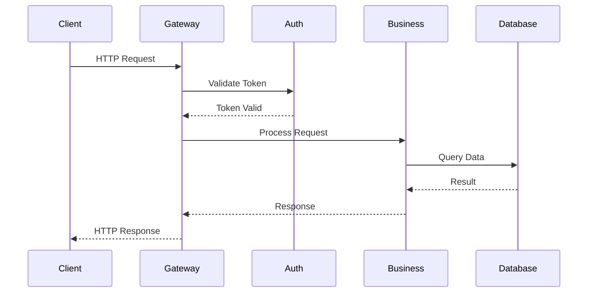
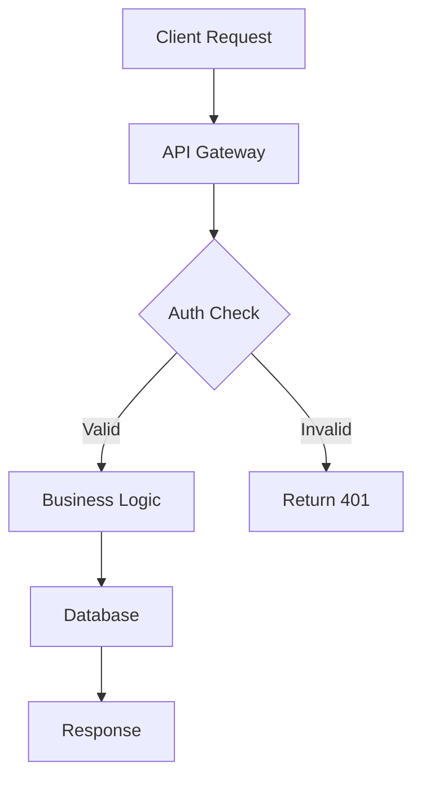
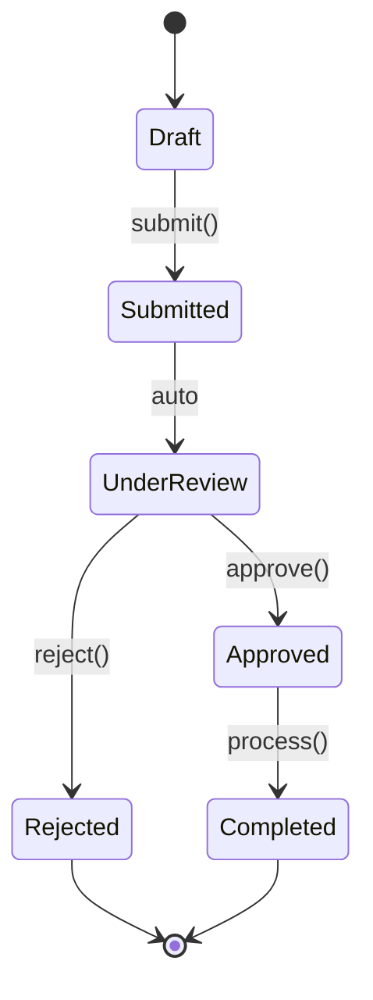
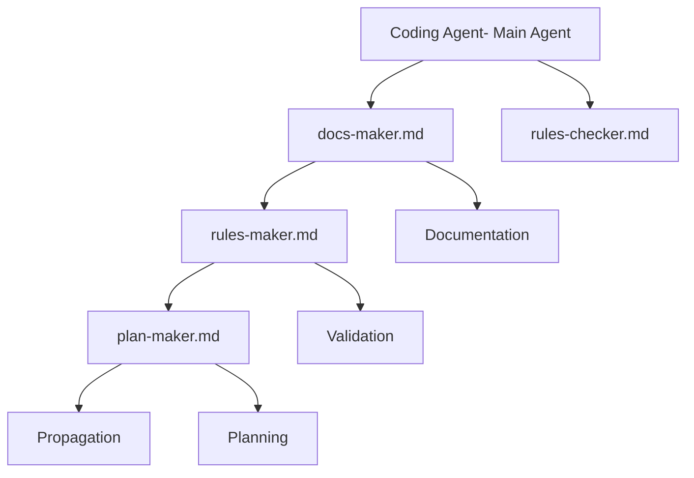

# Examples in Context

## Example 1: API Flow in Documentation

**File**: `docs/explanation/architecture/request-flow.md`

**Use Mermaid**:

````markdown
## Request Processing Flow


````

## Example 2: Project Structure in README

**File**: `README.md`

**Recommended: Use Mermaid for Complex Diagrams**:

````markdown
## Project Architecture


````

**Alternative: Use ASCII for Simple Directory Trees**:

```markdown
## Project Structure

open-sharia-enterprise/
├── .opencode/ # Secondary coding-agent binding
├── docs/ # Documentation
│ ├── tutorials/ # Step-by-step guides
│ ├── how-to/ # Problem solutions
│ └── reference/ # Technical specs
├── src/ # Source code
└── package.json # Dependencies
```

## Example 3: State Machine in Tutorial

**File**: `docs/tutorials/transactions/tu-tr__transaction-lifecycle.md`

**Use Mermaid**:

````markdown
## Transaction States


````

## Example 4: Component Architecture in AGENTS.md

**File**: `AGENTS.md`

**Recommended: Use Mermaid**:

````markdown
## Agent Architecture


````

**Alternative: Use ASCII for Simple Hierarchies**:

```markdown
## Agent Architecture

Coding Agent(Main Agent)
├── docs-maker.md (Documentation)
├── rules-checker.md (Validation)
├── rules-maker.md (Propagation)
└── plan-maker.md (Planning)
```
