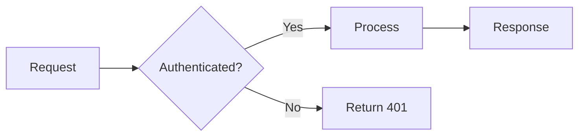

# Format Selection Rule: Rationale and Examples

## Why This Split?

ASCII art and Mermaid solve different representational problems.

**File and folder trees** are a direct mirror of filesystem reality. When a reader sees `├── apps/`, they recognize immediately what `ls -la` or `tree` would show. Every markdown renderer — including raw terminal `cat`, GitHub web, offline static sites, and plain-text email — displays ASCII trees identically. No validator, no parser, no width constraint applies.

**Relationship and flow diagrams** encode structure that has no natural text-linear representation. A sequence diagram describes temporal ordering. A dependency-direction diagram encodes which module knows about which. An ER diagram expresses cardinality. ASCII art can approximate these, but it encodes spatial relationships by character-position accident: changing one node forces manual re-alignment of every surrounding character. Mermaid encodes the relationship explicitly in its source, renders the spatial layout automatically, can be validated by `./rhino md mermaid validate`, and exposes its structure to screen readers.

## Examples

**ASCII tree (correct for folder structure):**

```
apps/
├── organiclever-www/
│   ├── src/
│   └── tests/
└── organiclever-be/
    ├── src/
    └── tests/
```

**Mermaid flowchart (correct for process/decision flows):**



These two formats are not interchangeable. Using Mermaid for a folder tree introduces a parse target where none is needed. Using ASCII art for a flowchart loses semantic structure and cannot be validated.
