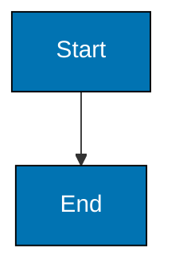
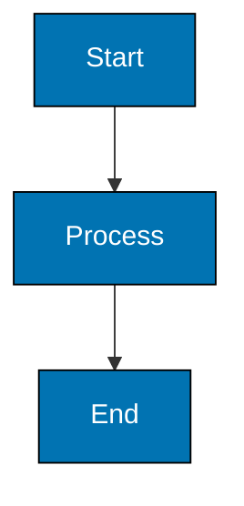

# Mermaid Comment Syntax

**CRITICAL**: Mermaid comments MUST use `%%` syntax, NOT `%%{ }%%` syntax.

**Correct Syntax** ():



**Incorrect Syntax** ():

```text
%% WRONG EXAMPLE - DO NOT USE
%% The %%{ }%% syntax below is INVALID and will cause errors
%% %%{ This is a comment }%%
%% %%{ Color Palette: Blue #0173B2, Orange #DE8F05, Teal #029E73 }%%
graph TD
    A[Start] --> B[End]
```

**Why**: The `%%{ }%%` syntax causes "Syntax error in text" in Mermaid rendering. The correct syntax is simply `%%` followed by the comment text.

**Common Mistake**: Adding curly braces around comments is invalid Mermaid syntax. Always use plain `%%` comments.

**Example (Color Palette Comment)**:



**Exception - Mermaid Initialization Directives**:

The `%%{init:...}%%` syntax is VALID when used for Mermaid initialization directives (theme configuration, variables). This is DIFFERENT from comments:

- **Valid Init Directive**: `%%{init: {'theme': 'base', 'themeVariables': {...}}}%%` - For theme customization
- **Invalid Comment**: `%%{ Color Palette: ... }%%` - WRONG syntax for comments
- **Valid Comment**: `%% Color Palette: ...` - Correct syntax for comments

**Key Distinction**: `%%{...}%%` is ONLY valid when containing `init:` directive for Mermaid configuration. Never use it for general comments, color palette notes, or documentation.

**When to Use Init Directives**: Rarely needed. Most diagrams use default theming. Use only when you need to customize Mermaid's theme variables or configuration.
