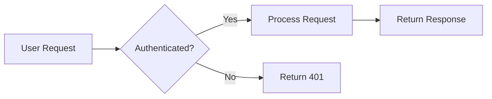
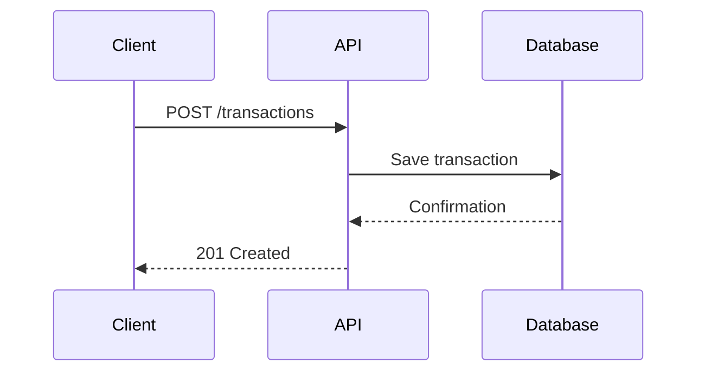
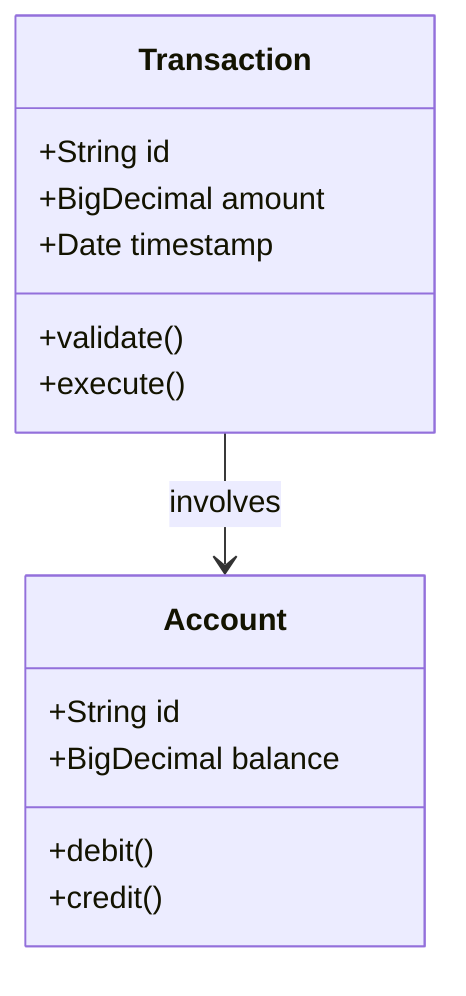
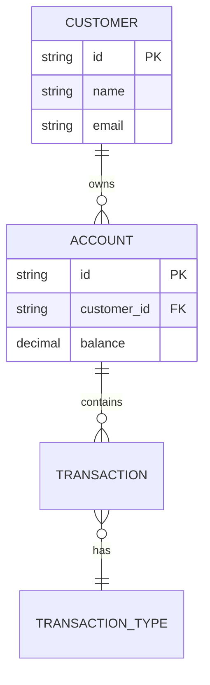
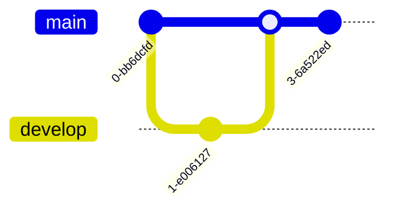
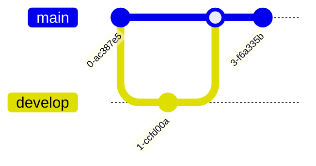

# Common Mermaid Diagram Types

## Flowchart

Perfect for processes, workflows, and decision trees:

````markdown

````


## Sequence Diagram

Shows interactions between components over time:

````markdown

````


## Class Diagram

Represents object-oriented structures and relationships:

````markdown

````


## Entity Relationship Diagram

Shows database schema relationships:

````markdown

````


## State Diagram

Illustrates state transitions in systems:

````markdown

````


```mermaid
stateDiagram-v2
    accTitle: State Diagram
    accDescr: start moves to Pending; Pending moves to Processing on start; Processing moves to Completed on success; Processing moves to Failed on error; Failed moves to Pending on retry; Completed moves to end.
    [*] --> Pending
    Pending --> Processing : start
    Processing --> Completed : success
    Processing --> Failed : error
    Failed --> Pending : retry
    Completed --> [*]
```

## Git Graph

Shows branch and merge history:

````markdown

````


