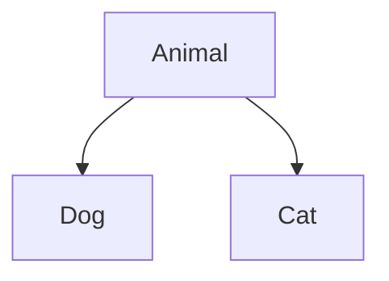
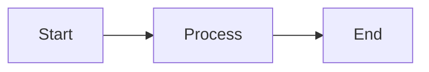

# Diagram Orientation

**Default Layout: Left-to-Right (LR)**

**CRITICAL RULE**: Mermaid flowcharts and graph diagrams MUST use `flowchart LR` or `graph LR` (left-to-right layout) by default.

**Rationale**:

- LR diagrams fit within viewport width on mobile screens without horizontal scrolling
- Nodes stack vertically in LR layout, using the natural scroll direction on mobile
- Consistent user experience across all documentation content

**Default directive**: Use `flowchart LR` or `graph LR` as the opening line of every flowchart or graph diagram unless a semantic exception applies (see below).

**When changing existing diagrams**: Replace `flowchart TD`, `graph TD`, `graph BT`, and `flowchart BT` with their `LR` equivalents unless: (a) the diagram is semantically justified to remain top-down (see exception below), or (b) switching to LR would cause the depth to exceed MaxWidth=4 (in which case TD keeps depth as the unchecked vertical axis — see Flowchart Width Constraints).

**Exception — semantically required TD**: A diagram MAY use `TD` when top-down direction is intrinsic to the meaning of the diagram (for example, a class hierarchy diagram where parent classes appear above child classes to show inheritance direction). Add a `%%` comment on the line immediately before the diagram type directive explaining why TD is required:

**sequenceDiagram is unaffected**: The `sequenceDiagram` type has no orientation directive and is not subject to this rule.

**Example (standard LR default)**:

