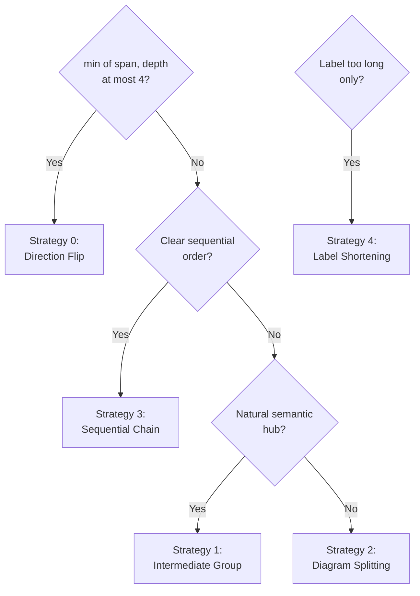

# Width Violation Fix Strategy Guide

When `./rhino md mermaid validate` reports a `width_exceeded` violation, select the simplest fix strategy that works:

**Selection decision tree**:



**Strategy 0 — Direction Flip** (preferred when the other axis is ≤ 4):

Change `graph TD` → `graph LR` (or vice versa). The horizontal dimension switches axis.

```
# Before — TD, span=5 (5 children share rank 1) → violation (5 > MaxWidth=4)
graph TD
    A --> B
    A --> C
    A --> D
    A --> E
    A --> F

# After — LR, horizontal=depth=2 ≤ MaxWidth=4, vertical=span=5 → no violation
graph LR
    A --> B
    A --> C
    A --> D
    A --> E
    A --> F
```

**Strategy 1 — Intermediate Grouping**: Insert a semantic hub node that branches connect through, reducing fan-out at any single rank.

**Strategy 2 — Diagram Splitting**: Break one wide diagram into two or more focused diagrams with prose bridges between them.

**Strategy 3 — Sequential Chaining**: Linearize parallel branches when logical order can be established: `A --> B --> C` instead of `A --> B` / `A --> C` / `A --> D`.

**Strategy 4 — Label Shortening** (for `label_too_long` violations):

- Replace HTML entities with abbreviated text: `#40;` → `(`, `#41;` → `)`
- Abbreviate: `Configuration` → `Config`, `Implementation` → `Impl`
- Split on `<br/>` and shorten each line to ≤ 30 chars
- Move dropped detail into prose before/after the diagram
