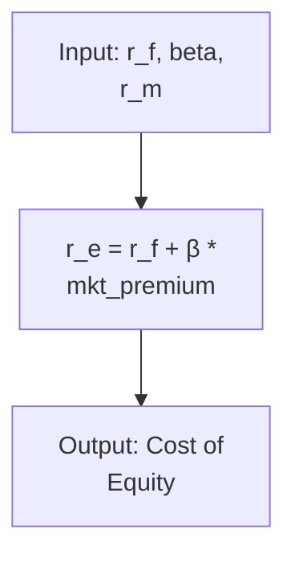

# Where NOT to Use LaTeX

## Code Blocks

Inside code blocks, use plain text or code-appropriate notation:

```python
# PASS: Correct - Plain text in code
def calculate_wacc(equity, debt, cost_of_equity, cost_of_debt, tax_rate):
    """
    Calculate WACC = (E/V) * r_e + (D/V) * r_d * (1 - T_c)
    """
    total_value = equity + debt
    wacc = (equity / total_value) * cost_of_equity + \
           (debt / total_value) * cost_of_debt * (1 - tax_rate)
    return wacc
```

```python
# FAIL: Incorrect - Don't use LaTeX in code
def calculate_wacc(equity, debt, cost_of_equity, cost_of_debt, tax_rate):
    """
    Calculate $WACC = \frac{E}{V} \times r_e + \frac{D}{V} \times r_d \times (1 - T_c)$
    """
    # LaTeX doesn't render in code blocks
```

## Mermaid Diagrams

Mermaid diagrams don't process LaTeX. Use plain text notation:



## ASCII Art Diagrams

In ASCII diagrams (for files outside `docs/`), use plain text:

```
Formula: WACC = (E/V) * r_e + (D/V) * r_d * (1 - T_c)
                 │      │       │      │         │
                 │      │       │      │         └─ Tax rate
                 │      │       │      └─ Cost of debt
                 │      │       └─ Debt ratio
                 │      └─ Cost of equity
                 └─ Equity ratio
```

## Configuration Files

Never use LaTeX in JSON, YAML, or configuration files:

```yaml
# PASS: Correct - Plain text
financial_formulas:
  wacc: "(E/V) * r_e + (D/V) * r_d * (1 - T_c)"
```

```yaml
# FAIL: Incorrect
financial_formulas:
  wacc: "$WACC = \\frac{E}{V} \\times r_e + \\frac{D}{V} \\times r_d \\times (1 - T_c)$"
```
