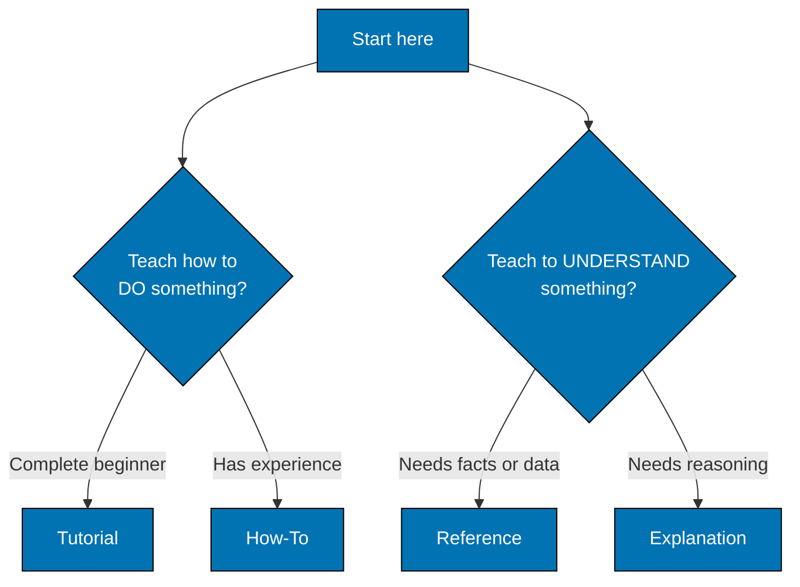

# Choosing the Right Category, and Common Mistakes to Avoid

## Choosing the Right Category

When creating new documentation, ask:

1. **Is the user learning a new skill?** → Tutorial
2. **Does the user have a specific problem to solve?** → How-To
3. **Does the user need to look up specific information?** → Reference
4. **Does the user need to understand concepts or "why"?** → Explanation

### Decision Tree

## Common Mistakes to Avoid

### FAIL: Mixing Categories

**Don't**:

- Put explanations in tutorials (breaks flow)
- Put step-by-step instructions in reference (wrong format)
- Put troubleshooting in explanations (not actionable)

**Do**:

- Link between categories when needed
- Keep each document focused on its category
- Cross-reference related content

### FAIL: Wrong Category Choice

**Tutorial misuse**:

- FAIL: "Understanding Authentication Concepts" → Should be Explanation
- PASS: "Building Your First Authenticated Endpoint" → Correct Tutorial

**How-To misuse**:

- FAIL: "Learning the API Basics" → Should be Tutorial
- PASS: "How to Add Rate Limiting" → Correct How-To

**Reference misuse**:

- FAIL: "Why We Chose PostgreSQL" → Should be Explanation
- PASS: "PostgreSQL Configuration Options" → Correct Reference

**Explanation misuse**:

- FAIL: "Steps to Deploy" → Should be How-To
- PASS: "Understanding Our Deployment Architecture" → Correct Explanation
