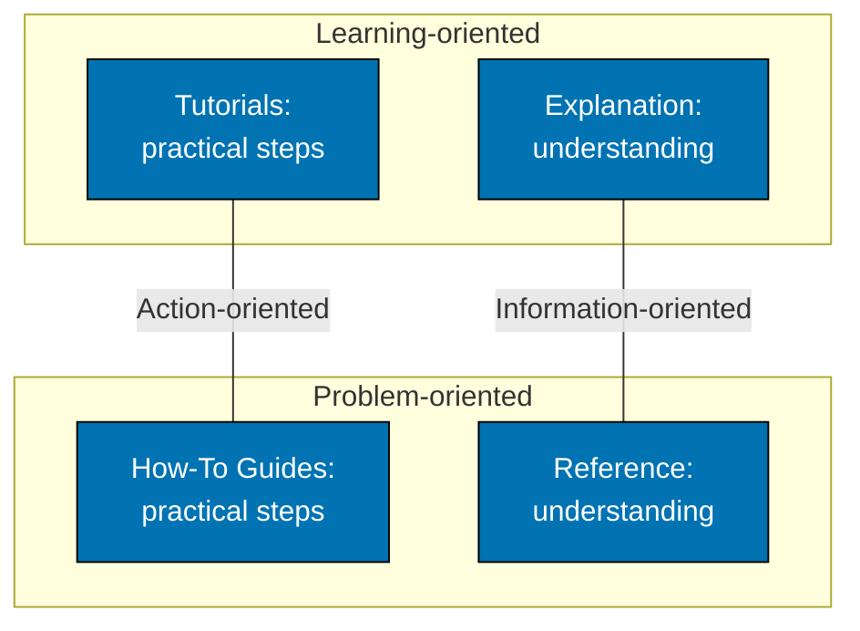

# What is Diátaxis, and Why We Use It

## What is Diátaxis?

Diátaxis is a systematic approach to technical documentation authoring that divides documentation into four distinct categories based on user needs and context:

Each category serves a different purpose and addresses different user needs.

## Why We Use Diátaxis

### Benefits for Documentation Writers

1. **Clear Categorization** - Know exactly where new documentation belongs
2. **Consistent Structure** - Follow established patterns for each category
3. **Reduced Duplication** - Separate concerns prevent overlap
4. **Easier Maintenance** - Changes are localized to specific categories

### Benefits for Documentation Users

1. **Find What They Need** - Categories match user intent
2. **Right Level of Detail** - Each category serves its purpose
3. **Progressive Learning** - Clear path from beginner to expert
4. **Efficient Lookup** - Reference material is separate from tutorials

### Benefits for the Project

1. **Scalability** - Framework grows with the project
2. **Quality** - Clear standards improve documentation quality
3. **Completeness** - Framework reveals gaps in coverage
4. **Onboarding** - New contributors understand documentation structure
