# Corpus Disposition

Part of the [Learning-Plan `syllabus/` Folder Convention](../learning-plan-syllabus.md).

Every learning-bearing plan that **owns** a corpus (its **custodian** — see the
[Custody Rule](./custody-rule.md)) declares a `## Corpus Disposition` section in its selected
technical form: `tech-docs.md`, or a mapped companion owned by `tech-docs/README.md` when the
directory form is selected. The section has exactly one of the following values. A plan that only **consumes** another plan's
corpus never carries a `## Corpus Disposition` section — it is not learning-bearing in its own
right (see the [Learning-Bearing Trigger](./learning-bearing-trigger.md)'s negative example 2)
and instead carries the `custodied-by:<plan-id>` echo under its own `## Corpus Custody` heading,
defined in the Custody Rule.

| Value               | Meaning                                                                | Extra obligation                                                     |
| ------------------- | ---------------------------------------------------------------------- | -------------------------------------------------------------------- |
| `archive-with-plan` | **Default.** The corpus moves to `plans/done/` with the plan folder    | None                                                                 |

```mermaid
%% Corpus lifecycle: the default path is the left spine; promotion is trigger-gated.
stateDiagram-v2
    accTitle: Corpus Disposition
    accDescr: start moves to Authored on plan creates syllabus/; Authored moves to ArchiveWithPlan on no consumer outside plans/; Authored moves to Promoted on a non-plan consumer exists; and 5 more links.
    [*] --> Authored: plan creates<br/>syllabus/
    Authored --> ArchiveWithPlan: no consumer outside<br/>plans/
    Authored --> Promoted: a non-plan consumer<br/>exists
    ArchiveWithPlan --> Archived: plan moves to<br/>plans/done/
    ArchiveWithPlan --> Promoted: non-plan consumer<br/>appears
    Promoted --> DurableHome: git mv + links<br/>rewritten
    Archived --> [*]
    DurableHome --> [*]
```

| `promote-to:<path>` | The corpus has a consumer outside `plans/` and moves to a durable home | A delivery step performing the move and rewriting every inbound link |

**The default is `archive-with-plan`.** A syllabus corpus is the specification a deliverable was
built from — the same role a hi-fi `.excalidraw.png` mockup plays for a UI screen — and, like that
mockup, it archives with the plan unless a concrete outside consumer exists. The durable product is
the shipped course body under `apps/ayokoding-www/content/`, not the syllabus that specified it.

**The promotion trigger is falsifiable, not a vibe.** A corpus MUST switch to `promote-to:` the
moment a **consumer outside `plans/`** reads it: a checker or agent, an Nx target, a build or
generation step, or shipped content front-matter that references a syllabus path. The test an author
applies is: **name the non-plan reader**. If none can be named, the disposition stays
`archive-with-plan`.
