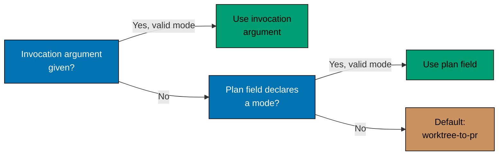

# Delivery Mode — Merge Authority and Resolution Precedence

Continues [Delivery Mode — main-to-origin-main Content Restriction](./delivery-mode-content-restriction.md).

**[AI] merges by default.** Every PR uses one convergent default route: the `Quality gate` check
from `.github/workflows/pr-quality-gate.yml` must be green for the exact current head and base, and
one authenticated `ose-pr-leak-review:v1` record must pass for that head.
Semantic review is not inferred from executable content, `plans/**`, risk, or delivery mode. A plan
may include [`pr-review`](../../../workflows/pr/pr-review.md) or
[`pr-review-cycle`](../../../workflows/pr/pr-review-cycle.md) only because the user explicitly
requested it, and only at a PR delivery boundary. The shared hardened preconditions also require a
current conflict-free branch, resolved conversations, and passing applicable finite surface gates;
see the [PR Merge Protocol](../../../development/workflow/pr-merge-protocol.md).

Where a plan **does** want human judgment at the merge point — an irreversible migration, a
production cutover, a change whose blast radius the gates cannot express — it says so explicitly in
the step itself, and that `[HUMAN]` gate then governs. Being explicit is the point: a merge gate that
exists because someone chose it is meaningful, while one that exists because it was the default is
indistinguishable from inertia.

**Three-tier precedence** — the active mode resolves deterministically:

```text
resolve_delivery_mode(invocation_arg, plan_field):
    if invocation_arg is a valid mode:      # tier 1: given at invocation time
        return invocation_arg
    if plan_field is a valid mode:          # tier 2: declared in the plan's own docs
        return plan_field
    return "worktree-to-pr"                 # tier 3: default
```



An invalid non-empty value at either tier (a string that is not one of the four modes) is a
`plan-checker` finding — it is never silently coerced to the default.

**Declaring the mode in a plan**: state it explicitly alongside the `## Worktree` /
`## Worktree Specification` declaration, e.g. `## Delivery Mode: worktree-to-pr`. An unmarked plan
resolves to the tier-3 default per the algorithm above.

See the [plan-execution workflow](../../../workflows/plan/plan-execution.md) for how each mode changes
Step 0 (worktree entry), the per-phase push target, and Step 8 (finalization and merge hand-off).
