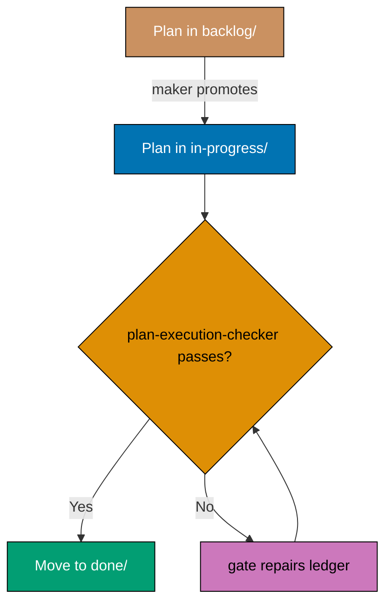

# Diagrams in Plans — Skipping, Accessibility, and Example

Continues [Diagrams in Plans](./diagrams-required.md).

## When a Plan MAY Skip Diagrams

This section defines the "where appropriate" escape hatch for the extensive-diagram requirement above. Text-only is acceptable only when the plan is genuinely linear and trivially small — it touches no distinct architectural concern that a diagram would clarify:

- Existing pre-contract single-file plans retained only for compatibility; new trivial changes do
  not require a formal plan
- Renames, copy edits, documentation fixes
- Dependency bumps with no behavioural change

For any plan that goes beyond these cases, the extensive-where-appropriate rule applies and each diagram-warranting concern listed above should have its own diagram.

## Accessibility and Palette Requirements

All plan diagrams MUST follow repository diagram standards: use the color-blind friendly palette, mobile-friendly orientation, and correct Mermaid comment syntax. Key invariants:

- Never use red, green, or yellow fills in diagram nodes — these are invisible or ambiguous for the most common color-blindness types.
- Always use black borders (`stroke:#000000`) and white text (`color:#FFFFFF`) on dark fills.
- Use only the eight verified accessible hex codes: `#0173B2` (blue), `#DE8F05` (orange), `#029E73` (teal), `#CC78BC` (purple), `#CA9161` (brown), `#808080` (gray), `#000000` (black), `#FFFFFF` (white).

This convention does **not** redefine those rules in full — consult the authoritative sources:

- **Palette and WCAG AA rules** — [Color Accessibility Convention](../../formatting/color-accessibility.md) — authoritative source for the verified palette, hex codes, contrast ratios, and color-blindness coverage
- **Diagram syntax and orientation** — [Diagram and Schema Convention](../../formatting/diagrams.md) for full Mermaid syntax, ASCII fallback rules, LR orientation default, and width constraints
- **Palette and accessibility Skill** — [`docs-creating-accessible-diagrams`](../../../../.agents/skills/docs-creating-accessible-diagrams/SKILL.md) for the verified WCAG-compliant hex codes, dos and don'ts, and agent-usable reference

## Example: Plan-Appropriate Flowchart

A plan introducing a multi-step approval flow benefits from a decision-branch diagram:

````markdown

````

The same scope described only in prose ("plans move from backlog to in-progress to done, with a check-fix loop if validation fails") forces every reader to rebuild the branching mentally; the diagram makes the loop explicit.

For complete diagram standards, see [Diagram and Schema Convention](../../formatting/diagrams.md).
