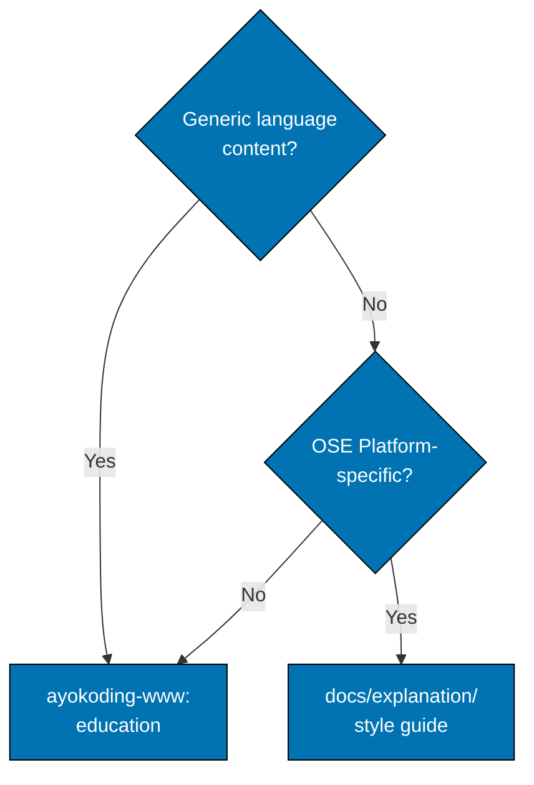

# Content Separation Rules: No Duplication and Cross-Referencing

## Rule 4: No Duplication Between Platforms

**CRITICAL**: Content covered in ayokoding-www MUST NOT be duplicated in docs/explanation/.

**Decision tree**:



Examples for `ayokoding-www`: syntax, by-example code, generic error patterns, DDD in Rust. Examples for
`docs/explanation/`: "We use Axum for HTTP", "Name bindings like this in OSE Platform".

**Example - Error Handling**:

**ayokoding-www** (a Rust in-practice error-handling lesson):

````markdown
# Error Handling in Rust

This guide covers generic Rust error patterns.

## The Error Trait

Rust models fallibility in the type system:

```rust
pub enum Result<T, E> {
    Ok(T),
    Err(E),
}
```
````

Use `thiserror` to define error enums, `?` to propagate them...

````

**docs/explanation/** (`docs/explanation/.../rust/error-handling.md`):

```markdown
# Rust Error Handling - OSE Platform Standards

**Prerequisite**: Complete the ayokoding-www Rust error-handling lesson first.

## OSE Platform Error Standards

In OSE Platform, all errors MUST:

1. Use structured logging with the `tracing` crate
2. Include request IDs for tracing
3. Follow error code taxonomy: `ERRZAKAT001`, `ERRWAQF001`

Example:

```rust
// OSE Platform pattern
let total = calculate_zakat(&input).map_err(|err| {
    tracing::error!(request_id = %req_id, error_code = "ERRZAKAT001", %err,
        "zakat calculation failed");
    ZakatError::Calculation { code: "ERRZAKAT001", source: err }
})?;
````

**Why**: Enables distributed tracing, compliance auditing, Shariah audit trails.

````

**Key differences**:

- **ayokoding-www**: Generic Rust error patterns (what `Result` is, how to define an error enum)
- **docs/explanation/**: OSE Platform-specific error conventions (structured logging, error codes, audit requirements)

## Rule 5: Cross-Referencing Pattern

**Required linking between platforms**:

**From docs/explanation/ → ayokoding-www**:

```markdown
## Prerequisite Knowledge

**This documentation assumes you have completed the ayokoding-www {LANGUAGE} learning path**:

- [ayokoding-www {LANGUAGE} Overview](https://ayokoding.com/en/learn/.../programming-languages/{language}/)
- [By Example Tutorial](https://ayokoding.com/en/learn/.../programming-languages/{language}/by-example/)

If you're new to {LANGUAGE}, **start with ayokoding-www first**.
````

**From ayokoding-www → docs/explanation/** (optional, when relevant):

```markdown
## Repository-Specific Guides

For OSE Platform-specific {LANGUAGE} conventions, see:

- OSE Platform {LANGUAGE} Style Guide: `docs/explanation/software-engineering/programming-languages/{language}/`
```

**Linking rules**:

- docs/explanation/ README.md MUST link to ayokoding-www (prerequisite)
- ayokoding-www MAY link to docs/explanation/ (optional, for contributors)
- Use absolute URLs for ayokoding-www (Next.js site)
- Use relative paths for docs/explanation/ (GitHub markdown)
