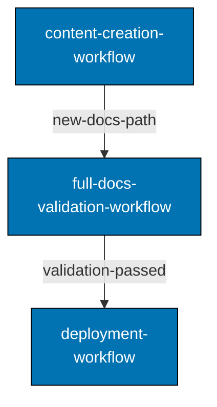

# Composability

Workflows are first-class composable units. A workflow step can be another workflow, an agent, or a procedure — in any combination and order, with bounded loops (a quality gate runs at most three cycles).

```markdown
### 2. Run Validation Workflow (Nested)

**Workflow**: `quality/docs-software-engineering-separation-quality-gate`

- **Args**: `subject: {input.subject}`
- **Output**: `{verdict}`

This step executes another workflow.
```

Mixed composition example — agents, procedures, and nested workflows in one workflow:

```markdown
### 1. Prepare Environment (Procedure)

Run `rtk ./hippo run --class transactional --resource-tier standard --disk-path . -- npm install`, then
`rtk npm run doctor`; provision with `./rhino toolchain provision --apply` only if it reports drift.

### 2. Validate Docs (Nested Workflow)

**Workflow**: `quality/docs-software-engineering-separation-quality-gate`

- **Args**: `subject: docs/explanation/software-engineering, mode: strict`
- **Output**: `{docs-status}`

### 3. Validate CI (Nested Workflow)

**Workflow**: `quality/ci-quality-gate`

- **Args**: `subject: apps/ose-www`
- **Output**: `{ci-status}`

### 4. Report Summary (Agent)

**Agent**: `docs-maker`

- **Args**: `docs-status: {step2.outputs.docs-status}, ci-status: {step3.outputs.ci-status}`
```

Output from one workflow becomes input to another:



Each arrow carries the upstream workflow's output, and the deployment workflow consumes `validation-passed`.
