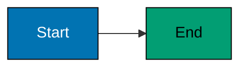

# Mermaid Diagram Guidelines

## When to Include Diagrams

**INCLUDE diagram when**:

- **Concept flow** spans multiple steps or components
- **State machines** have multiple states and transitions
- **Concurrency** involves multiple threads/processes/actors
- **Architecture** shows relationships between components
- **Comparison** between approaches benefits from visual aid
- **Learning path** shows progression through topics

**SKIP diagram when**:

- Single-function concept with linear execution
- Simple syntax demonstration
- Trivial operation or calculation
- Concept is clearer from narrative + code alone

## Diagram Frequency Target

**Guideline**: 30-50 total diagrams per language (same as by-example)

**Production standards** (ayokoding-www enhanced target):

- **Beginner level**: 10-15 diagrams (50-40% of 15-25 sections)
- **Intermediate level**: 10-15 diagrams (60-75% of 12-20 sections)
- **Advanced level**: 10-15 diagrams (60-75% of 10-20 sections)

**Current production state** (ayokoding-www, needs enhancement):

- Most languages: 8-15 diagrams total (below target)
- Dart: 46 diagrams (above target, good reference)

**Rationale**: By-concept sections cover broader topics than by-example individual examples, so higher diagram percentage per section (60-75% vs 30-50%) achieves similar total diagram count (30-50).

## Color-Blind Friendly Palette

**Mandatory colors** (WCAG AA compliant):

- **Blue** #0173B2 - Primary elements, starting states
- **Orange** #DE8F05 - Secondary elements, processing states
- **Teal** #029E73 - Success states, outputs
- **Purple** #CC78BC - Alternative paths, options
- **Brown** #CA9161 - Neutral elements, helpers

**Forbidden colors**: Red, green, yellow (not color-blind accessible)

**Comment syntax**: Use `%%` for comments (NOT `%%{ }%%` which causes syntax errors)

