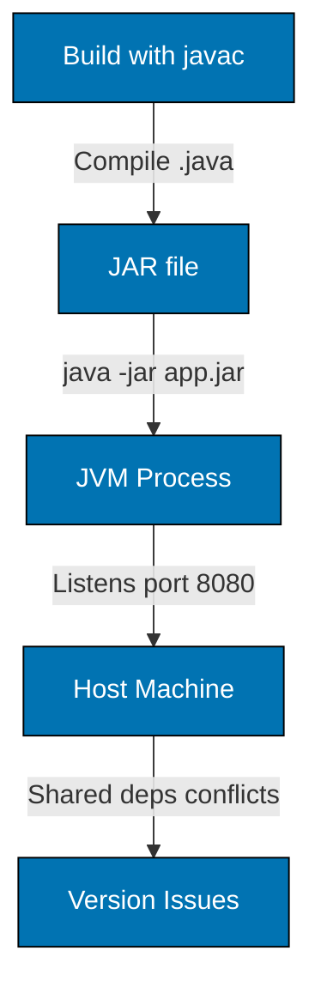
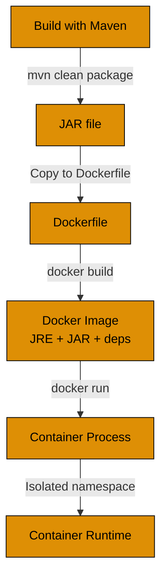
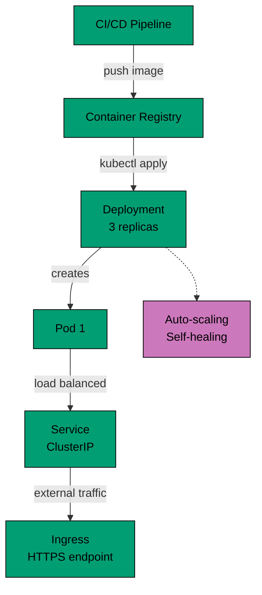

# Guide Structure Part 4: Containerization and CI/CD Flow Diagrams

**Example 4a: Containerization - Standard Library (JAR Deployment)**

**Limitation**: Dependency conflicts on host machine, manual deployment, no isolation.

**Example 4b: Containerization - Framework (Docker)**

**Improvement**: Application isolation, no dependency conflicts, portable across environments.

**Example 4c: Containerization - Production (Kubernetes)**

**Production benefit**: High availability, auto-scaling, rolling updates, self-healing, load balancing.

**Example 5: CI/CD Pipeline Flow (Vertical)**

```mermaid
%% Color Palette: Blue #0173B2, Orange #DE8F05, Teal #029E73, Purple #CC78BC
graph TD
    accTitle: Guide Structure Part 4: Containerization and CI/CD Flow Diagrams (4)
    accDescr: Developer commits leads to Source Control GitHub/GitLab via git push; Source Control GitHub/GitLab leads to CI Server Jenkins/GitHub Actions via webhook; CI Server Jenkins/GitHub Actions leads to Compile & Build via Stage 1; and 10 more links.
    A[Developer commits] -- git push --> B[Source Control<br/>GitHub/GitLab]
    B -- webhook --> C[CI Server<br/>Jenkins/GitHub<br/>Actions]
    C -- Stage 1 --> D[Compile & Build]
    D -- Stage 2 --> E[Run Tests]
    E -- Stage 3 --> F[Quality Gates]
    F -- Stage 4 --> G[Build Docker Image]
    G -- Stage 5 --> H[Push to Registry]
    H -- deploy --> I[Deploy to Staging]
    I -- smoke tests --> J[Manual Approval]
    J -- approved --> K[Deploy to Production]
    K -- rollout --> L[Load Balancer]
    L -- monitoring --> M[Observability]
    M -.-> note1[Rollback on failure]

    classDef blue fill:#0173B2,stroke:#000000,color:#FFFFFF
    classDef orange fill:#DE8F05,stroke:#000000,color:#000000
    classDef teal fill:#029E73,stroke:#000000,color:#000000
    classDef purple fill:#CC78BC,stroke:#000000,color:#000000
    class A,B blue
    class C,D,E,F,G,H orange
    class I,J,K,L teal
    class M,note1 purple
```

