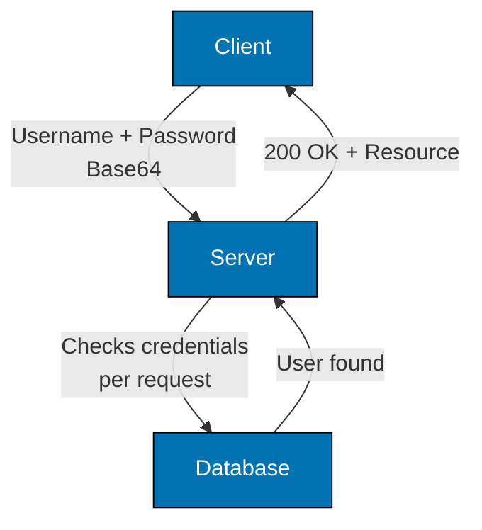
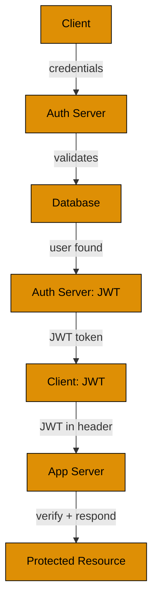

# Guide Structure Part 4: Diagram Guidance and Authentication Flow

**When to include**:

- Architecture patterns (multi-tier, microservices, event-driven)
- Data flow across multiple systems
- State machines or lifecycle diagrams
- Deployment topologies
- Integration patterns
- Authentication/authorization flows
- Database persistence patterns
- Containerization architectures
- CI/CD pipelines
- Messaging patterns

**When NOT to include**:

- Simple linear processes
- Single-service patterns
- Trivial workflows

**Diagram requirements**:

- Use color-blind friendly palette: Blue #0173B2, Orange #DE8F05, Teal #029E73, Purple #CC78BC, Brown #CA9161
- Include descriptive labels
- Focus on production architecture/flow
- Use appropriate diagram type
- Show progression from standard library to framework

**Example 1: TDD State Machine**

```mermaid
%% Color Palette: Blue #0173B2, Orange #DE8F05, Teal #029E73, Purple #CC78BC
stateDiagram-v2
    accTitle: Guide Structure Part 4: Diagram Guidance and Authentication Flow
    accDescr: start moves to Red on Write test; Red moves to Green on Test fails; Green moves to Refactor on Test passes; Refactor moves to Red on Tests still pass, next feature.
    [*] --> Red: Write test

    Red --> Green: Test fails
    Green --> Refactor: Test passes
    Refactor --> Red: Tests still pass,<br/>next feature

    note right of Red
        🔴 RED
        Write failing test
        Specify desired behaviour
    end note

    note right of Green
        🟢 GREEN
        Write minimum code
        Make test pass
    end note

    note right of Refactor
        ♻️ REFACTOR
        Improve code quality
        Keep tests passing
    end note

    classDef redState fill:#CC78BC,stroke:#000000,color:#000000
    classDef greenState fill:#029E73,stroke:#000000,color:#000000
    classDef refactorState fill:#0173B2,stroke:#000000,color:#FFFFFF

    class Red redState
    class Green greenState
    class Refactor refactorState
```

**Example 2a: Authentication Flow - Standard Library (Basic Auth)**

**Limitation**: Database query on every request (high latency, database load).

**Example 2b: Authentication Flow - Framework (JWT)**

**Improvement**: Single database query during login, subsequent requests use cryptographic verification (fast, stateless).
