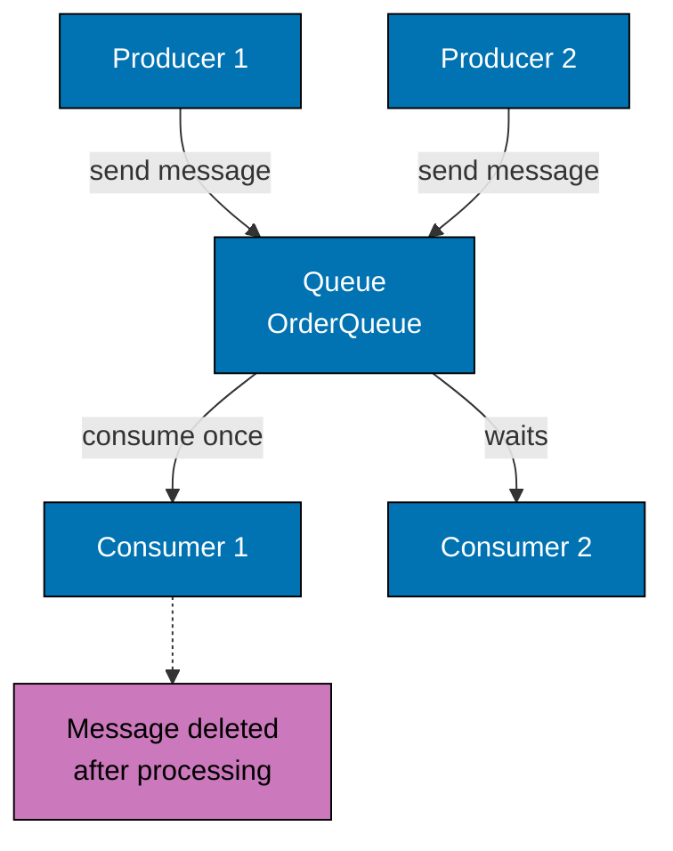
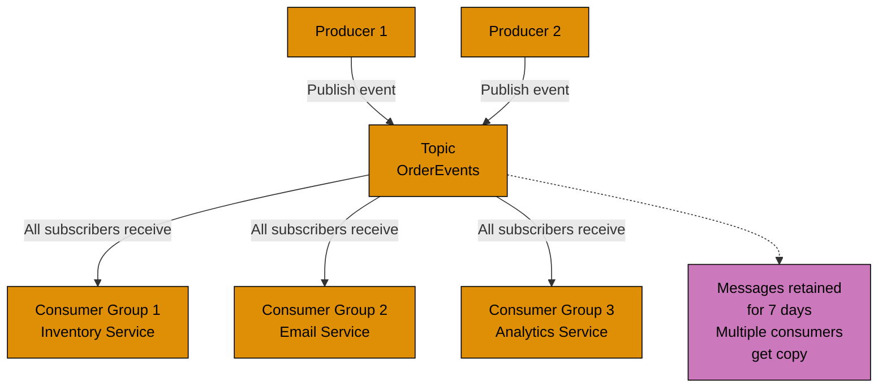
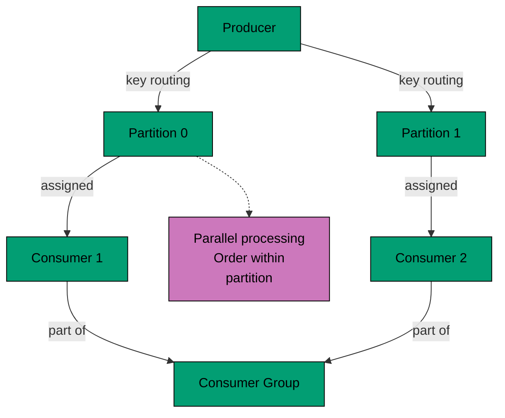

# Guide Structure Part 4: Messaging Flow Diagrams

**Example 6a: Messaging - Point-to-Point (JMS Queue)**

**Use case**: Work queue distribution, only one consumer should process each message.

**Example 6b: Messaging - Pub/Sub (Kafka Topic)**

**Use case**: Event broadcasting, multiple services need same events for different purposes.

**Example 6c: Messaging - Production (Kafka Partitions)**

**Production benefit**: Parallel processing with ordering guarantees within partition, horizontal scalability.
