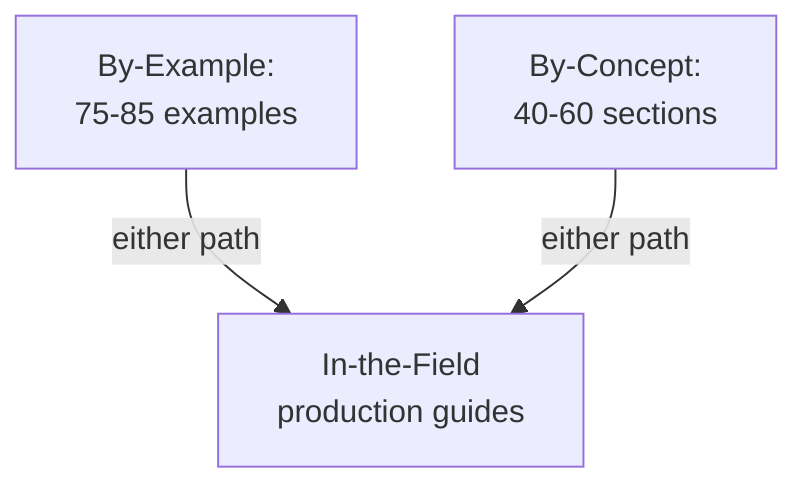

# Relationship to Other Tutorial Types

In-the-field tutorials complete the learning progression from foundations to production:

| Type              | Coverage             | Count | Approach                | Prerequisites                |
| ----------------- | -------------------- | ----- | ----------------------- | ---------------------------- |
| **Initial Setup** | 0-5%                 | 1-3   | Environment setup       | None                         |
| **Quick Start**   | 5-30%                | 5-10  | Project-based           | None                         |
| **By Example**    | 95%                  | 75-85 | Code-first examples     | None                         |
| **By Concept**    | 95%                  | 40-60 | Narrative + code        | None                         |
| **In-the-Field**  | Production scenarios | 20-40 | **Production patterns** | **By-example or by-concept** |

**Key distinction**:

- **By-example/by-concept**: Comprehensive language coverage (95%) using standard library, achieving foundational mastery
- **In-the-field**: Production scenarios using frameworks/libraries, building on foundations to create real systems

**Prerequisites flow**:

**Learning path example** (Java):

1. Complete by-example beginner (Examples 1-30, learn core Java)
2. Complete by-example intermediate (Examples 31-60, production patterns with standard library)
3. Read in-the-field guides:
   - TDD (assert → JUnit 5)
   - Build tools (javac → Maven → Gradle)
   - SQL (JDBC → HikariCP → JPA/Hibernate)
   - Docker/Kubernetes (java -jar → containers → orchestration)
