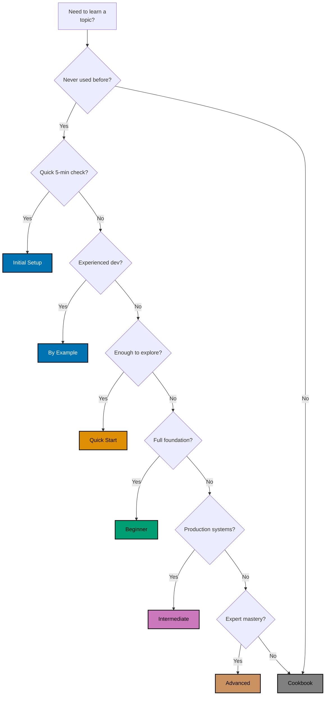

# Choosing the Right Tutorial Type

## Decision Tree

## Quick Reference Table

| Tutorial Component            | Coverage  | Purpose                               |
| ----------------------------- | --------- | ------------------------------------- |
| **FULL SET TUTORIAL PACKAGE** | **0-95%** | **All 5 components for completeness** |
| ↳ Foundational                |           |                                       |
| Initial Setup                 | 0-5%      | Installation and verification         |
| Quick Start                   | 5-30%     | Core concepts for exploration         |
| ↳ Learning Tracks             |           |                                       |
| By-Example (3 files)          | 95%       | **PRIORITY:** Code-first, move fast   |
| By-Concept (3 files)          | 95%       | Narrative-driven, learn deep          |
| ↳ Practical Reference         |           |                                       |
| Cookbook                      | Practical | Problem-solving recipes               |
