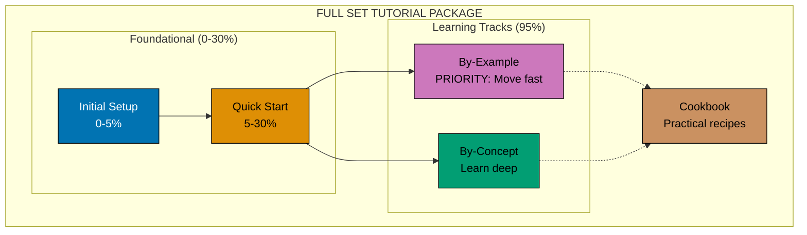

# Tutorial Types Overview

**Legend**:

- Solid arrows (→) show linear progression within the "Sequential Learning Path" (5 levels in by-concept/)
- Dotted arrows (⋯→) show complementary learning components used alongside sequential path
- Percentages indicate depth of domain knowledge coverage

**Full Set Tutorial Package**:

A **Full Set Tutorial Package** is a complete educational bundle with all 5 mandatory components providing 0-95% coverage through multiple learning modalities:

1. **Component 1-2: Foundational Tutorials** (0-30% coverage)
   - `initial-setup.md` (0-5%): Installation, verification, Hello World
   - `quick-start.md` (5-30%): Core concepts for independent exploration

2. **Component 3: By-Example Track** (95% coverage) - **PRIORITIZED for fast learning**
   - `by-example/` folder: Code-first learning through annotated examples
   - 3 files: beginner.md (1-25), intermediate.md (26-50), advanced.md (51-75)
   - 75-85 examples total with 1-2.25 annotation density
   - **Move fast**: Experienced developers learn quickly through working code

3. **Component 4: By-Concept Track** (95% coverage)
   - `by-concept/` folder: Narrative-driven comprehensive tutorials
   - 3 files: beginner.md (0-40%), intermediate.md (40-75%), advanced.md (75-95%)
   - 40-60 sections total achieving deep understanding
   - **Learn deep**: Complete beginners get full explanations

4. **Component 5: Cookbook** (Practical recipes)
   - `cookbook/` folder: Problem-solving reference
   - 30+ recipes organized by category
   - Complements both learning tracks

**Sequential Learning Path** (within by-concept/ folder):

- The 5 progressive levels in by-concept/ for deep learning
- Beginner → Intermediate → Advanced progression (0-95%)
- Provides narrative-driven foundation for complete beginners
