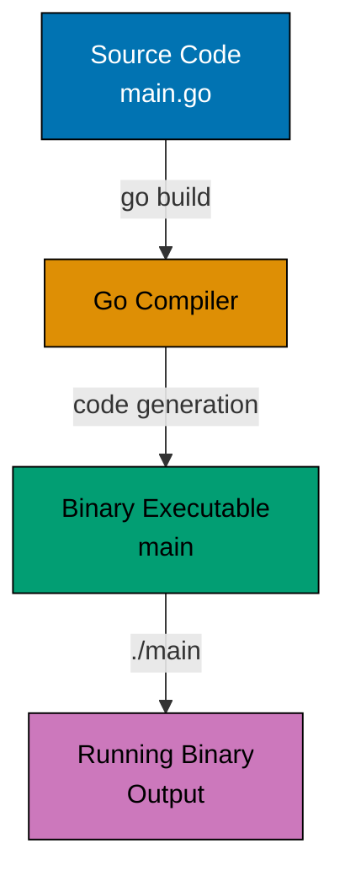

# Complete Example Structure (Production Reference)

Below is a complete example from ayokoding-www demonstrating all five parts in practice:

## Example 1: Hello World and Go Compilation (Golang)

Go is a compiled language - you write source code, compile it into a binary executable, then run that binary. Understanding this pipeline reveals why Go is fast and portable.



**Code**:

```go
package main // => Declares this is the main executable package
             // => "main" is special - it tells the compiler to create an executable
             // => Other package names (like "utils") create libraries, not executables

import (
    "fmt" // => Import formatting package from standard library
          // => fmt provides I/O formatting functions (Printf, Println, Sprintf, etc.)
          // => Standard library packages are always available, no installation needed
)

func main() { // => Entry point - every executable needs main() in main package
              // => Go runtime calls main() when program starts
              // => No parameters, no return value (unlike C/Java's int main)
              // => Program exits when main() returns

    fmt.Println("Hello, World!") // => Println writes to stdout and adds newline
                                  // => Returns (n int, err error) but we ignore them here
                                  // => n is bytes written, err is write error (if any)
                                  // => Equivalent to: fmt.Fprintln(os.Stdout, "Hello, World!")
    // => Output: Hello, World!
}
```

**Key Takeaway**: Every executable Go program needs `package main` and a `func main()` entry point. The `import` statement brings standard library packages into scope.

**Why It Matters**: Single-binary deployment makes Go ideal for containers and microservices, where `go build` produces a statically-linked executable with no runtime dependencies unlike Java (requires JVM) or Python (requires interpreter and packages). Docker containers for Go services are 5-10MB (vs 200MB+ for equivalent Java apps), enabling faster deployments, reduced attack surface, and simplified distribution as a single file that runs anywhere.

**Analysis of this example**:

- **Part 1 (Brief Explanation)**: 2 sentences explaining compiled language model
- **Part 2 (Diagram)**: Build pipeline visualization with 4 stages
- **Part 3 (Code)**: 7 code lines with 15 comment lines (2.14 density)
- **Part 4 (Key Takeaway)**: 2 sentences on essential requirements
- **Part 5 (Why It Matters)**: 62 words on production benefits
