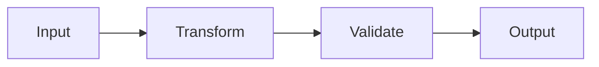
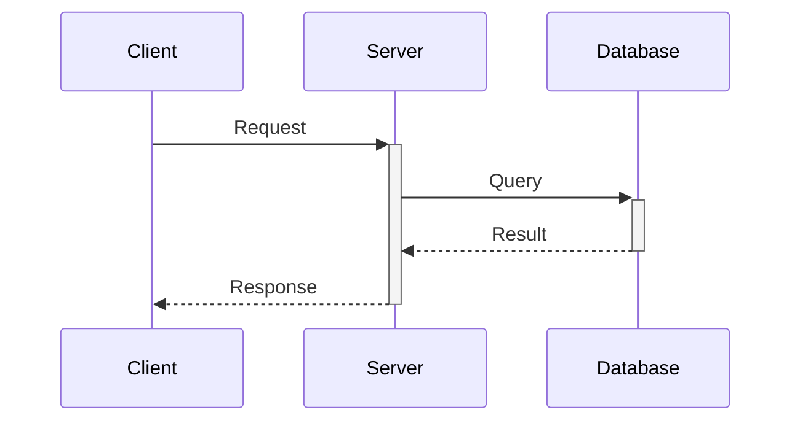
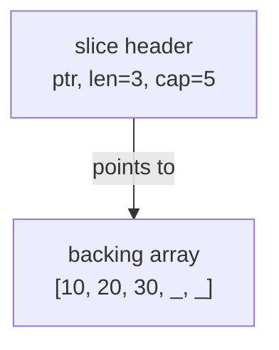
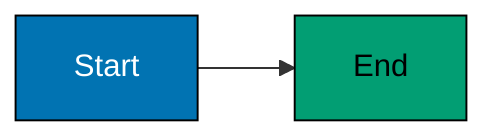

# Mermaid Diagram Guidelines

## When to Include Diagrams

**INCLUDE diagram when**:

- **Data flow** spans multiple functions/components
- **State machines** have multiple states and transitions
- **Concurrency** involves multiple goroutines/processes/actors
- **Request flow** traverses multiple layers (HTTP → router → controller → model)
- **Memory layout** clarifies pointer behaviour or data structures
- **Pipeline patterns** show data transformation stages
- **Error propagation** shows error handling across function calls

**SKIP diagram when**:

- Single function with linear execution
- Simple variable assignment or calculation
- Trivial control flow (basic if/else, simple loops)
- Concept is clearer from code alone

## Diagram Frequency Target

**Guideline**: 30-50% of examples should include diagrams (30-50 total diagrams per language)

**Actual diagram counts in production** (ayokoding-www):

- **Beginner level**: 7-11 diagrams (25-37% of 27-30 examples)
- **Intermediate level**: 8-17 diagrams (30-60% of 20-30 examples)
- **Advanced level**: 10-24 diagrams (40-86% of 25-28 examples)

**Total diagrams per language**: 30-48 diagrams across all levels

**Rationale**: Simple beginner concepts need fewer diagrams, while advanced topics (concurrency, memory management, state machines) benefit heavily from visualization.

## Diagram Types by Use Case

**Data flow**: `graph LR` or `graph TD`

**State transitions**: `stateDiagram-v2`

```mermaid
stateDiagram-v2
    accTitle: Diagram Types by Use Case (2)
    accDescr: start moves to Idle; Idle moves to Running on start; Running moves to Paused on pause; Paused moves to Running on resume; Running moves to end on stop.
    [*] --> Idle
    Idle --> Running: start()
    Running --> Paused: pause()
    Paused --> Running: resume()
    Running --> [*]: stop()
```

**Sequence of operations**: `sequenceDiagram`

**Memory layout**: `graph TD` with annotations

## Color-Blind Friendly Palette

**Mandatory colors** (WCAG AA compliant):

- **Blue** #0173B2 - Primary elements, starting states
- **Orange** #DE8F05 - Secondary elements, processing states
- **Teal** #029E73 - Success states, outputs
- **Purple** #CC78BC - Alternative paths, options
- **Brown** #CA9161 - Neutral elements, helpers

**Forbidden colors**: Red, green, yellow (not color-blind accessible)

**Comment syntax**: Use `%%` for comments (NOT `%%{ }%%` which causes syntax errors)

