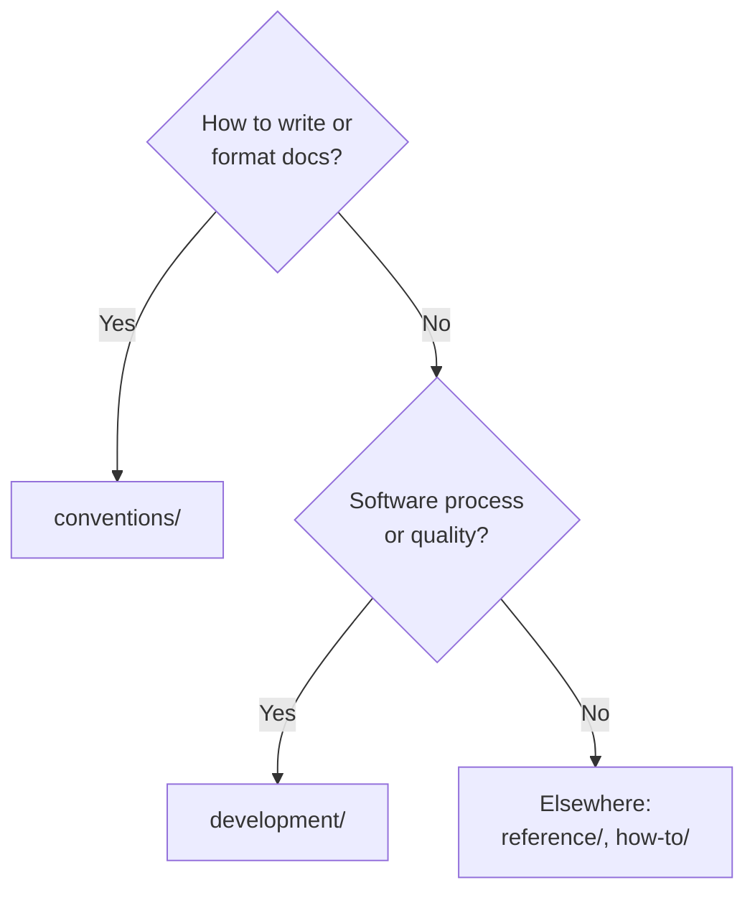

# Purpose, Principles, and Scope

## Principles Implemented/Respected

This convention implements the following core principles:

- **[Explicit Over Implicit](../../../principles/software-engineering/explicit-over-implicit.md)**: Required sections, clear scope boundaries, and explicit content structure for all conventions. No guessing about what belongs in conventions/ vs development/ - decision criteria are documented.

- **[Simplicity Over Complexity](../../../principles/general/simplicity-over-complexity.md)**: Standardized convention structure reduces cognitive load. Same sections in same order across all conventions - readers know what to expect.

## Purpose

Convention documents define **how to write and format documentation** in this repository. They establish standards for markdown syntax, content organization, visual elements, and content quality. This meta-convention ensures all convention documents follow consistent structure and quality standards.

## Scope

### What Belongs in conventions/

**PASS: Documentation writing and formatting standards:**

- Markdown syntax and formatting (linking, file naming, indentation)
- Content organization frameworks (Diátaxis, tutorials, plans)
- Visual elements in documentation (diagrams, colors, emojis, mathematical notation)
- Content quality and accessibility standards
- Specific documentation types (tutorials, plans, READMEs, app content)
- Documentation file formats and structures

### What Does NOT Belong in conventions/

**FAIL: Software development practices** (use `repo-governance/development/` instead):

- Development workflows (git, commits, testing, BDD)
- Build processes and tooling
- App theme/layout development (HTML templates, asset pipeline)
- Development infrastructure (temporary files, build artifacts)
- AI agent development standards
- Code quality and testing practices

### Decision Tree

### Examples of Scope Boundaries

| Topic                                             | Location                                                | Reasoning                            |
| ------------------------------------------------- | ------------------------------------------------------- | ------------------------------------ |
| How to write app content (frontmatter, markdown)  | `conventions/tutorials/programming-language-content.md` | About **writing** content            |
| How to develop Next.js components (layouts, etc.) | `development/` practices                                | About **building** infrastructure    |
| How to format tutorials                           | `conventions/tutorials/general.md`                      | About **writing** tutorials          |
| How to write acceptance criteria                  | `development/infra/acceptance-criteria.md`              | About **software quality** process   |
| How to name files                                 | `conventions/structure/file-naming.md`                  | About **documentation** organization |
| How to write commit messages                      | `development/workflow/commit-messages.md`               | About **git workflow**               |
