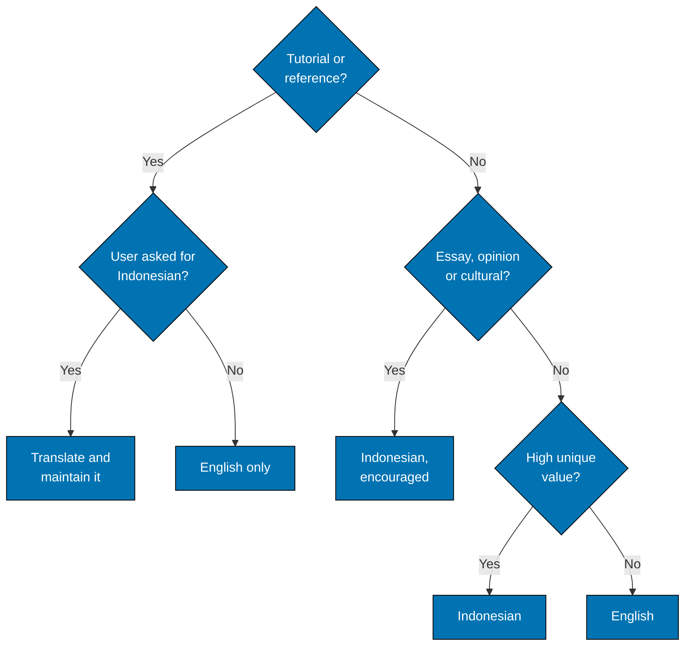

# Decision Tree and Cross-Reference Requirements

## Decision Tree: Should I Create Indonesian Content?

Use this decision tree when considering Indonesian content creation:



**Examples by Content Type**:

| Content Type                      | Default Language | Indonesian Version?              | Rationale                                   |
| --------------------------------- | ---------------- | -------------------------------- | ------------------------------------------- |
| Golang By-Example Tutorial        | English          | No (unless explicitly requested) | Technical tutorial, English-first policy    |
| Personal Reflection on Learning   | Indonesian       | Yes (encouraged)                 | Culturally-specific, unique value           |
| TypeScript Intermediate Tutorial  | English          | No (unless explicitly requested) | Technical tutorial, English-first policy    |
| Indonesian Tech Community Guide   | Indonesian       | Yes (encouraged)                 | Local ecosystem content                     |
| Java Quick Start                  | English          | No (unless explicitly requested) | Technical tutorial, English-first policy    |
| Git Cheat Sheet (Bahasa)          | Indonesian       | Yes (encouraged)                 | Quick reference, accessibility value        |
| React Hooks Explanation           | English          | No (unless explicitly requested) | Technical explanation, English-first policy |
| Career Advice for Indonesian Devs | Indonesian       | Yes (encouraged)                 | Culturally-specific career guidance         |

## Cross-Reference Requirements

**CRITICAL**: When Indonesian translations DO exist (by explicit request), both English and Indonesian versions MUST include cross-reference links.

**English Original → Indonesian Translation**:

```markdown
**Similar article:** [Judul Artikel Indonesia](/id/belajar/path/to/article)
```

**Indonesian Translation → English Original**:

```markdown
> _Artikel ini adalah hasil terjemahan dengan bantuan mesin. Karenanya akan ada pergeseran nuansa dari artikel aslinya. Untuk mendapatkan pesan dan nuansa asli dari artikel ini, silakan kunjungi artikel yang asli di: [English Article Title](/en/learn/path/to/article)_
```

**See**: [Programming Language Content Standard](../../tutorials/programming-language-content.md) for complete content standards.
