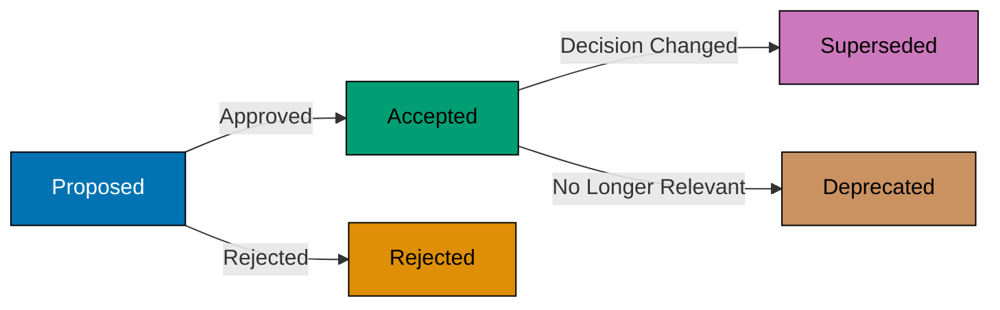

# ADRs: Storage, Lifecycle, and Review

## Storage and Naming

**Location:** `docs/adr/`

**Naming Pattern:** `NNNN-short-title.md`

- `NNNN` = 4-digit sequential number (0001, 0002, etc.)
- `short-title` = Kebab-case descriptive title
- Examples: `0001-use-nx-for-monorepo.md`, `0002-adopt-diataxis-framework.md`

**Index File:** `docs/adr/README.md` lists all ADRs with status

## Lifecycle Management

**Immutability:**

- ADRs are **immutable** after acceptance
- Do not edit the content of accepted ADRs
- If decision changes, create new ADR that supersedes old one

**Status Transitions:**

**Superseding ADRs:**

When decision changes, create new ADR:

1. Create new ADR with status "Proposed"
2. In new ADR context, reference previous ADR: "This supersedes ADR-0001"
3. After approval, update old ADR status: "Superseded by ADR-0005"
4. Do not modify old ADR's decision or consequences sections

## Review Process

**Meeting Format:**

- **Time-box:** 30-45 minutes maximum
- **Readout Style:** 10-15 minutes silent reading, then written feedback
- **Participants:** Cross-functional team, < 10 people
- **Author Ownership:** Author owns document and incorporates feedback

**Approval:**

- Team consensus required
- Document decision in ADR itself (add approval date)
- Update status from "Proposed" to "Accepted"
