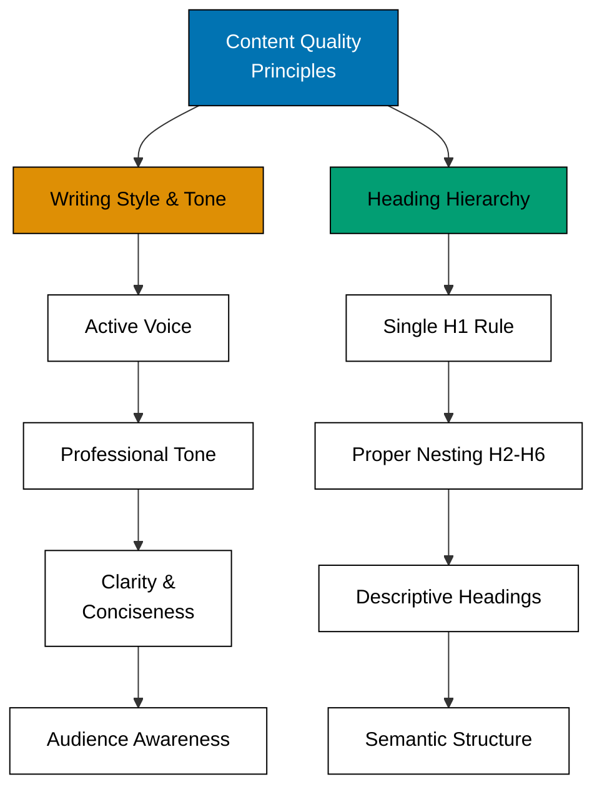
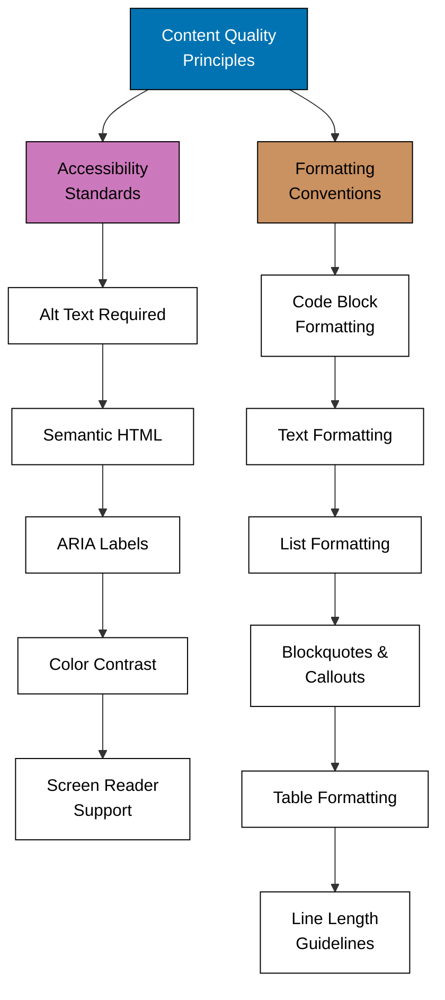

# Purpose, Scope, and Principles

## Principles Implemented/Respected

This convention implements the following core principles:

- **[Accessibility First](../../../principles/content/accessibility-first.md)**: Requires alt text for images, proper heading hierarchy, WCAG AA color contrast, semantic HTML structure, and screen reader support. Accessibility is not optional - it's a baseline requirement for all content.

- **[No Time Estimates](../../../principles/content/no-time-estimates.md)**: Permits labelled time estimates in documentation; only plan documents state no time estimates.

## Purpose

This convention establishes universal quality standards that apply to **all markdown content** in the repository. It ensures consistent writing quality, accessibility compliance, and professional presentation across documentation, ayokoding-www content, planning documents, and repository root files. These standards make content readable, maintainable, and accessible to all users including those using assistive technologies.

## Scope

These principles apply to markdown content in:

- **docs/** - Documentation (tutorials, how-to guides, reference, explanations)
- **apps/** - ayokoding-www and ose-www content
- **plans/** - Project planning documents
- **Repository root files** - README.md, CONTRIBUTING.md, SECURITY.md, etc.

**Universal Application**: Every markdown file in this repository should follow these quality principles, regardless of location or purpose.

%% TD required: concept hierarchy flows top-down from root principle to sub-principles

%% TD required: concept hierarchy flows top-down from root principle to sub-principles

