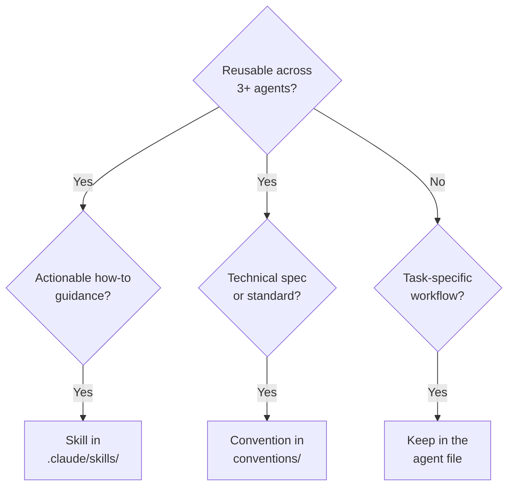

# Agent-Skill Separation — Purpose and Knowledge Classification

## Purpose

This section defines how to properly separate reusable knowledge (agent skills) from agent-specific instructions (Agent files), ensuring maintainability, reducing duplication, and enabling effective knowledge delivery.

**Validated through**: agent skills Simplification pilot (2026-01-03) - docs family achieved 49.2% size reduction while maintaining 100% functionality.

## Knowledge Classification Decision Tree

When writing or updating an agent, use this decision tree to determine where content belongs:

Examples: agent skills such as `applying-content-quality` and `creating-accessible-diagrams`; Conventions such as the
Color Accessibility Convention and the Mathematical Notation Convention in `repo-governance/conventions/`; and
agent-specific knowledge such as "When to use this agent", validation workflow steps, and tool usage patterns.
