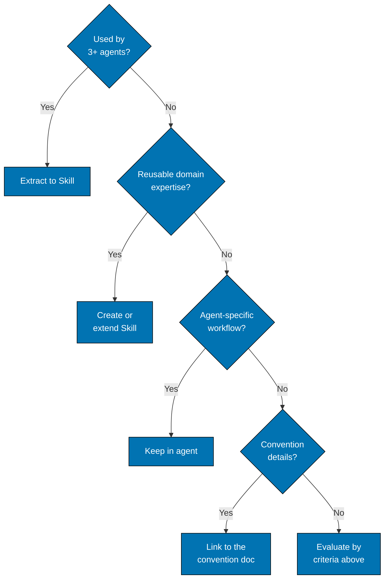

# Agent-Skill Separation — When to Use agent skills vs. Agent Content

**Purpose**: Eliminate duplication between agents by extracting reusable knowledge into agent skills. Agents remain focused on task-specific workflows while agent skills provide shared domain expertise.

## When to Use agent skills vs. Agent Content

Use this decision tree to determine where knowledge belongs:

Ask the questions in order; the first Yes decides. Domain expertise covers color palettes, validation standards, and report formats. Agent-specific workflow covers
task sequence, unique logic, and custom decisions. Convention details cover standards, rules, and formats; link to
the convention document and optionally reference a Skill.

## What Belongs in agent skills

**Extract to agent skills** (reusable knowledge):

1. **Validation Standards**
   - UUID chain generation logic
   - Progressive writing methodology
   - Report file naming patterns
   - Timestamp generation (UTC+7)
   - Criticality level definitions
   - Confidence assessment criteria

2. **Domain Expertise**
   - Content quality principles
   - Color accessibility palettes
   - Annotation density standards
   - Diátaxis framework application
   - Gherkin syntax rules

3. **Shared Workflows**
   - Maker-Checker-Fixer pattern
   - Link validation methodology
   - Factual accuracy verification
   - Mode parameter handling
   - Report discovery logic

## What Belongs in Agents

**Keep in Agents** (task-specific content):

1. **Task Workflows**
   - Step-by-step execution sequence
   - Agent-specific validation logic
   - Custom decision trees
   - Unique processing rules

2. **Scope Definitions**
   - What files/directories to validate
   - What to include/exclude
   - Agent mission and responsibilities
   - Collaboration with other agents

3. **Tool Usage Patterns**
   - How to use Read/Write/Bash/etc.
   - Tool combinations for specific tasks
   - Error handling strategies

4. **Output Formats**
   - Agent-specific report structures
   - Custom finding categories
   - Unique recommendation formats
