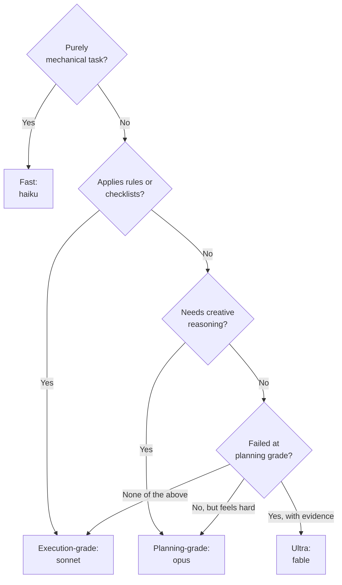

# Model Selection Guidelines

For complete model selection standards, see the [Model Selection Convention](../model-selection.md).

**Four grades**, each declared explicitly. There is no blank-`model` grade: an absent field
cannot be read as a deliberate choice, and inheritance made the same agent run at a different
capability on different accounts.

- **Ultra** (`model: fable`): Frontier-difficulty reasoning where a wrong answer is expensive to
  detect and expensive to undo. Currently assigned to no agent; admission requires recorded evidence
  of a planning-grade failure, never anticipated difficulty.
- **Planning-grade** (`model: opus`): Creative reasoning, code generation, architectural decisions,
  and nuanced content creation (creative makers, the four language developers, the governance trios).
- **Execution-grade** (`model: sonnet`): Rule-based validation, applying validated fixes,
  template-driven output, and structured pattern-following (checkers, fixers, structured makers,
  swe-e2e-dev).
- **Fast** (`model: haiku`): Purely mechanical tasks with no reasoning required — URL validation,
  deployment scripts, deterministic file operations (deployers, link checkers, docs-file-manager).

Each grade also fixes an `effort`: ultra and planning at `high`, execution and fast at `xhigh` — a
weaker model is compensated with more reasoning effort. Effort belongs to the grade, not the agent,
so an agent MUST declare the effort its grade declares.

```binding-example
Concrete model identifiers per platform:
  Ultra:            model: fable    (Claude Code)
  Planning-grade:   model: opus     (Claude Code)
  Execution-grade:  model: sonnet   (Claude Code)
  Fast:             model: haiku    (Claude Code)
```

The grade-to-identifier mapping for every harness lives in the `harness:` registry's `model-map:`
in `repo-config.yml`, not in code. A harness that declares no `model-map:` pins no model at all.

## Model Selection Decision Tree

Enter from the bottom: each grade must be argued past, never assumed.



Structured procedures count as applying rules; code generation, architectural decisions, and nuanced content
creation count as creative reasoning. Execution-grade is the default for ambiguous cases because it is safer than
fast.

**Important**: Every agent MUST include a `**Model Selection Justification**` block explaining why the chosen grade is appropriate. `harness claude validate` fails any agent whose body omits it, and any agent whose `effort` contradicts its grade. See [Model Selection Convention](../model-selection.md) for full requirements.
