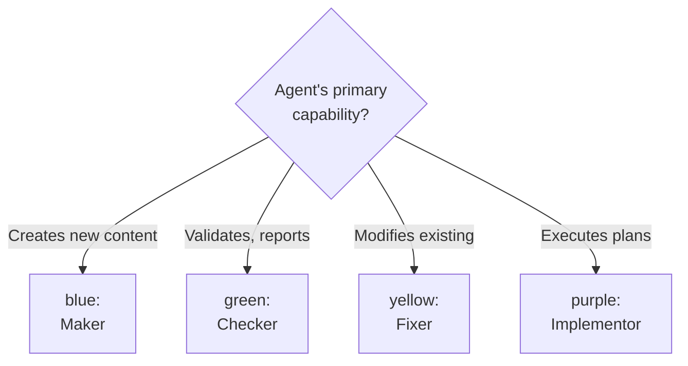

# Platform Binding Examples — Assigning Colors to New Agents

When creating a new agent, assign a color based on its **primary capability**:

**Decision Tree:**

- Maker (`blue`): must have `Write`. Examples: docs-maker, plan-maker.
- Checker (`green`): has `Write` and `Bash` but no `Edit`; `Write` is needed for audit reports in
  `local-tmp/<agent-family>/`, and `Bash` for UTC+7 timestamps. Examples: rules-checker, plan-checker,
  docs-checker. Exception: link checkers also have the `Edit` tool for cache management (see "Link Checker Agents
  Note" below).
- Fixer (`yellow`): has `Edit` but not `Write`. Examples: docs-file-manager, readme-fixer, repo-workflow-fixer.
- Implementor (`purple`): has `Write`, `Edit`, and `Bash`. Examples: `swe-*-dev` agents; plan execution itself is
  orchestrated by the calling context via the plan-execution workflow (no dedicated subagent).

**Edge Cases:**

- **Agent has both Write and Edit**: Choose based on primary purpose
  - If mainly creates new content → `blue` (Maker)
  - If mainly executes plans/tasks → `purple` (Implementor)
- **Link-checkers with Write, Edit, Bash**: Use `green` (Checker)
  - Write tool needed for audit reports in `local-tmp/<agent-family>/`
  - Edit tool needed for cache file management (external-links-status.yaml updates)
  - Bash tool needed for UTC+7 timestamps
  - Examples: docs-link-checker, apps-ayokoding-www-link-checker
- **Deployers with Bash only**: Use `purple` (Implementor)
  - Execute deployment orchestration (purple's "executes plans/orchestrates tasks")
  - Don't create or edit files, only run git/deployment commands
  - Edge case: purple without Write/Edit tools (Bash-only orchestration)
  - Examples: apps-ayokoding-www-deployer, apps-ose-www-deployer, apps-organiclever-app-web-deployer
- **Fixers with Write tool**: Investigate actual usage
  - Yellow (Fixers) should have Edit but NOT Write
  - If Write is needed for creating new convention files → keep yellow, document exception
  - If Write can be removed → remove Write to match yellow categorization
  - Example: readme-fixer, repo-workflow-fixer (fixer agents that generate audit reports, keep Write for report writing)
- **Agent doesn't fit any category**: Consider if it should be split or if a new category is needed
- **Unsure**: Default to the most restrictive category based on tools, or omit the color field

**Accessibility Note**: All assigned colors (blue, green, yellow, purple) are verified color-blind friendly and meet WCAG accessibility standards per the [Color Accessibility Convention](../../../conventions/formatting/color-accessibility.md). Agents should still be identified primarily by name and role suffix, not color alone, to ensure accessibility for all users. See the Color Accessibility Convention for complete details on palette verification, testing methodology, and WCAG compliance.
