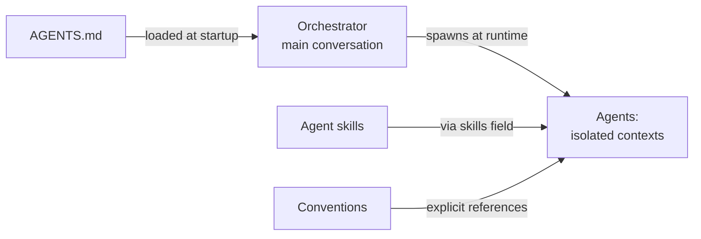

# Relationship to AGENTS.md — Division, Maintenance, and Isolation

## Division of Responsibilities

**AGENTS.md provides:**

- PASS: Project-wide guidance for ALL agents
- PASS: Project overview and context
- PASS: Environment setup (Volta, Node.js, npm)
- PASS: Git hooks and commit conventions
- PASS: High-level documentation organization
- PASS: Reference to this AI agents convention

**Individual agents provide:**

- PASS: Specialized domain expertise
- PASS: Specific task instructions
- PASS: Detailed guidelines for their area
- PASS: Examples and checklists for their domain

**This convention (ai-agents.md) provides:**

- PASS: Standards for how agents are structured
- PASS: Agent creation guidelines
- PASS: Tool and model selection criteria
- PASS: Convention referencing requirements

## AGENTS.md Maintenance Standards

**CRITICAL:** AGENTS.md is a navigation document, not a knowledge dump. All agents must help maintain its conciseness.

**Size Limits:** governed solely by the
[Governance Word-Budget Convention](../../../conventions/structure/governance-word-budget.md).
Thresholds live in `repo-config.yml` and are enforced deterministically at pre-push and in CI — no
agent judges the size by eye, and no other document restates the numbers.

**Agent Responsibilities:**

1. **Content agents (`rules-maker`, `docs-maker`, and peers):**
   - MUST NOT add verbose content to AGENTS.md
   - When adding conventions, create the detailed doc first, then a brief AGENTS.md summary
   - When the budget gate reports an over-budget file, remediate by progressive disclosure — split
     it and link annotated children; never compress to squeak under, never raise a threshold

2. **All agents:**
   - When in doubt, link to detailed docs rather than duplicate content
   - Each AGENTS.md section should answer "what, where, why" but link to "how"
   - Comprehensive details belong in convention docs, not AGENTS.md

## Agent Isolation and Delivery Pattern

**Critical Understanding:**

1. **Agents have isolated contexts** - They do NOT inherit AGENTS.md
2. **Agent skills deliver explicitly** - OnlySkills listed in agent's `skills:` field are available
3. **References are explicit** - Agents link to specific conventions they need
4. **Orchestrator has AGENTS.md** - Main conversation loads AGENTS.md, not agents

**Rules:**

1. **Don't duplicate** - Agents should reference conventions, not repeat content
2. **Do specialize** - Agents add domain expertise through agent skills and explicit knowledge
3. **Follow conventions** - All agents must comply with this convention
4. **Declare skills explicitly** - Every agent must have non-empty `skills:` field
