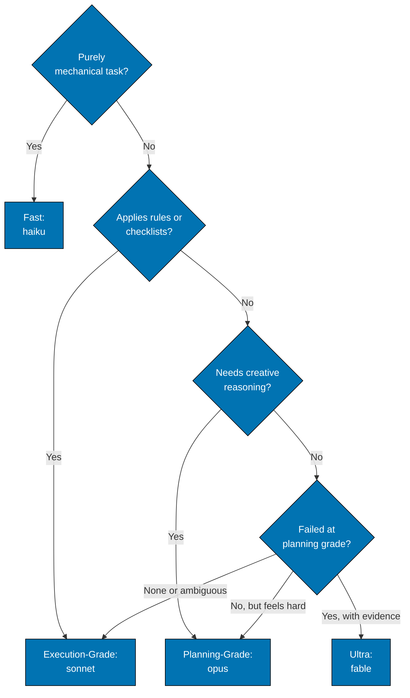

# Model Selection Decision Tree

The tree is entered from the bottom. Each grade must be argued past, never assumed.

Structured procedures count as applying rules; code generation, architectural decisions, and nuanced content
creation count as creative reasoning. Ultra needs recorded evidence of failure at the planning grade on a task that
is expensive to detect and expensive to undo. Execution-Grade is the default for ambiguous cases because it is safer
than fast.

Ultra is the only grade that cannot be reached by prediction. It requires the recorded evidence
described in [Model Tiers — Ultra](./model-tiers-ultra.md#admission-evidence); anticipated
difficulty is not evidence.
