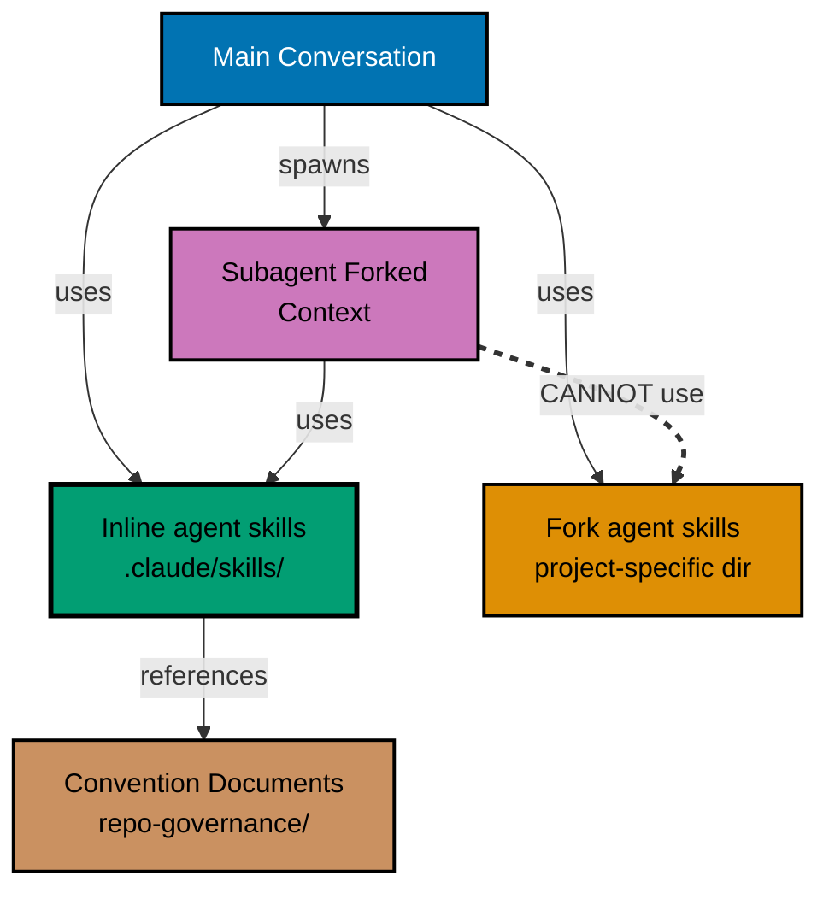

# Architecture Diagram

**Key**:

- Blue: Main conversation context
- Purple: Delegated agent (forked) context
- Green: Universal inline skills (works everywhere)
- Orange: Fork skills (main conversation only)
- Brown: Convention documents (governance layer)
- Dashed: Architectural constraint (cannot do)
