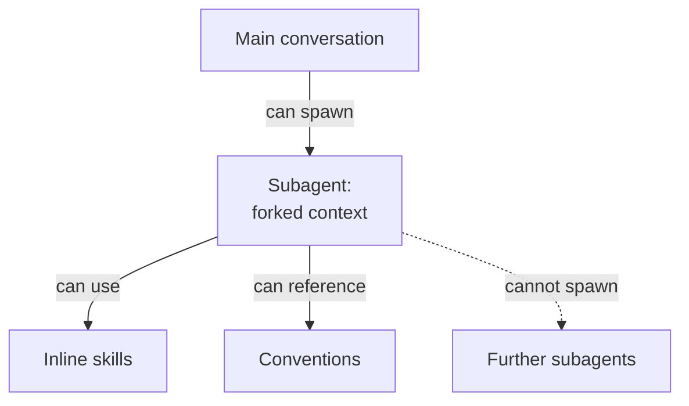

# The Architectural Constraint

## Core Limitation

**Delegated agents cannot spawn other delegated agents.**

This is a fundamental architectural constraint of AI coding agent systems:

## Impact on agent skills

Since skills with `context: fork` spawn delegated agents:

1. **Main conversation** can use fork skills ✅ (spawns delegated agent successfully)
2. **Delegated agents** cannot use fork skills ❌ (would require spawning nested delegated agent)

If `.agents/skills/` contains fork skills:

- ✅ Work in main conversation
- ❌ Break when used by delegated agents
- ❌ Reduce skill composability
- ❌ Create confusing "works sometimes" behaviour
