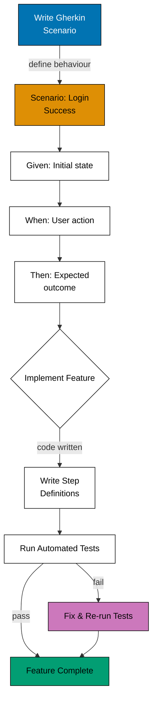

# Mermaid Diagram, Related Conventions, and Summary

## Mermaid Diagram: Gherkin Workflow

<!-- Uses accessible colors: blue (#0173B2), orange (#DE8F05), teal (#029E73) -->

## Related Conventions

- [Behaviour-Driven Development](../../behaviour-driven-development.md) - Mandatory 1:1 mapping between CLI commands and Gherkin specifications
- [Plans Organization Convention](../../../conventions/structure/plans.md) - Where to use acceptance criteria in plans
- [Tutorial Convention](../../../conventions/tutorials/general.md) - Acceptance criteria for tutorial quality
- [Content Quality Principles](../../../conventions/writing/quality.md) - Writing clear, testable content

## Summary

**Use Gherkin format for acceptance criteria to**:

- PASS: Ensure requirements are clear and unambiguous
- PASS: Enable direct translation to automated tests
- PASS: Create living documentation that stays up-to-date
- PASS: Facilitate communication between business and technical teams
- PASS: Force concrete, testable conditions

**Follow best practices**:

- Be specific with concrete values
- One scenario per behaviour
- Use present tense
- Focus on behaviour, not implementation
- Make it testable
- Use data tables for multiple inputs

**Apply to**:

- Project plans and requirements
- Feature specifications and RFCs
- API documentation
- Test documentation and QA checklists
