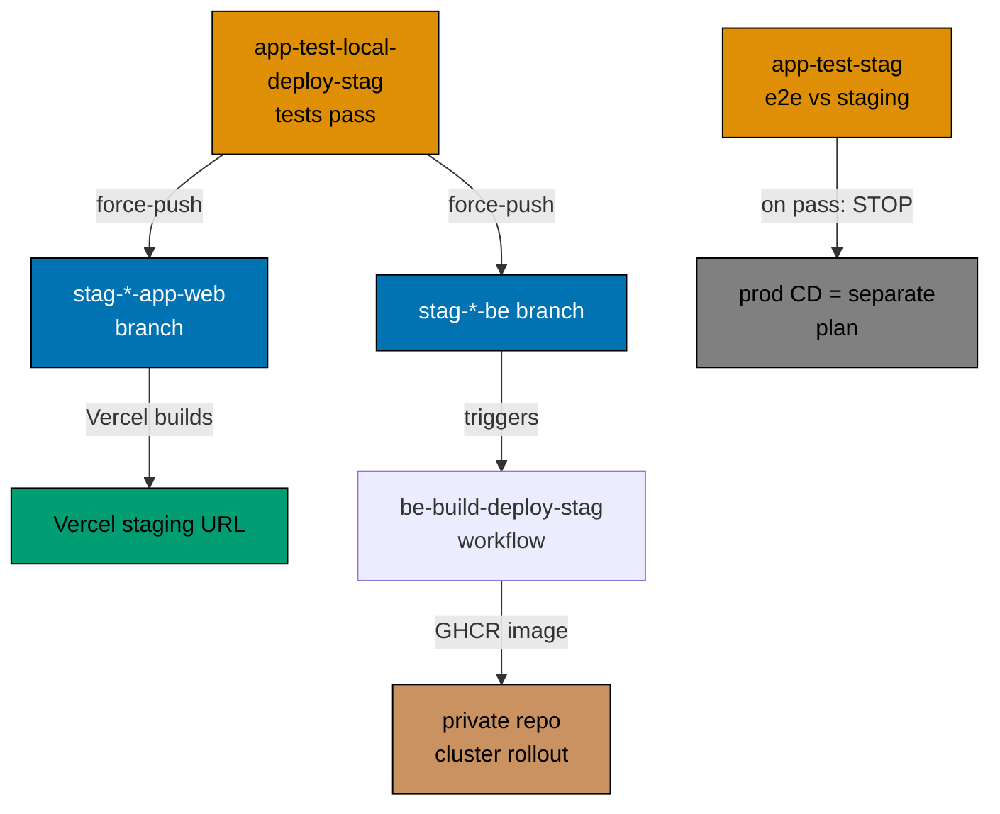

# Deploy Model and Examples

## Deploy Model

"Deploy" in every workflow name is a **branch force-push**, never a direct cluster or Vercel API
call:



- **Web (Vercel)**: The branch push is the entire deploy — Vercel listens to `stag-*`/`prod-*`
  branches and builds from them. Workflows push the branch; Vercel does the rest.
- **Backend (non-Vercel)**: The app-tier deploy force-pushes the `stag-*-be` branch. A separate
  `{product}-be-build-deploy-stag.yml` (triggered on push to that branch) builds and pushes the
  GHCR image. The actual k3s rollout runs in ose-private via `coralpolyp` — out of this repo.
- **Prod CD**: Production deployment for app-tier workflows is deferred to a separate follow-on
  plan. Because no prod deploy happens yet, the app-tier staging gate ends at the `test-stag` verb —
  it is named `{group}-app-test-stag.yml` (it runs e2e against the deployed staging URL and stops on
  pass), with **no** `deploy-prod` segment. The `deploy-prod` qualifier is used today only by
  www-tier callers (`*-www-test-local-deploy-prod`, direct to prod) and is reserved for the app tier
  for when its prod CD lands (at which point the terminal step would extend to
  `*-app-test-stag-deploy-prod`).

## Examples

### PASS: Correctly aligned name and filename (new grammar)

```yaml
# File: .github/workflows/pr-quality-gate.yml
name: PR - Quality Gate
```

Derivation: `PR - Quality Gate` → lowercase → `pr - quality gate` → spaces to hyphens →
`pr---quality-gate` → collapse hyphens → `pr-quality-gate` → append `.yml` →
`pr-quality-gate.yml`. Matches filename.

---

```yaml
# File: .github/workflows/organiclever-app-test-local-deploy-stag.yml
name: OrganicLever App - Test Local Deploy Stag
```

Derivation: lowercase + spaces-to-hyphens + collapse → `organiclever-app-test-local-deploy-stag` →
append `.yml` → `organiclever-app-test-local-deploy-stag.yml`. Matches filename.

### FAIL: Wrong prefix order (action before domain)

```yaml
# File: .github/workflows/test-and-deploy-organiclever-www.yml  ← action first
name: Test and Deploy - OrganicLever WWW
```

The domain (`organiclever-www`) must come first. Correct filename:
`organiclever-www-test-local-deploy-prod.yml`.

### FAIL: Using `_reusable-` on a caller workflow

```yaml
# File: .github/workflows/_reusable-organiclever-app-test-local-deploy-stag.yml  ← wrong
```

The `_reusable-` prefix is reserved for `workflow_call` reusables only. Caller workflows must
not carry this prefix.
