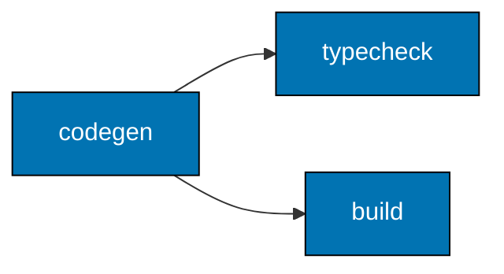

# Codegen Dependency Chain

Apps with OpenAPI contract specs share a `codegen` target that generates types and
encoders/decoders from the spec (e.g., `specs/apps/organiclever/be/contracts/`) into
`generated-contracts/`.

The dependency chain is:

Both `typecheck` and `build` declare `dependsOn: ["codegen"]` in their `project.json`. This
ensures generated contract types are always present before type-checking or building begins.

**`test:unit` and `test:quick` do NOT directly depend on `codegen`** — they depend on source
files being correct, which is already enforced by `typecheck` and `build`. Some build systems (Rust) require generated code at compile time and therefore keep
`dependsOn: ["codegen"]` in `test:unit` / `test:quick`.

**Rationale**: Making `codegen` a dependency of `typecheck` and `build` (rather than of test
targets) keeps the dependency graph minimal and avoids running codegen redundantly during test
runs when artifacts already exist from a prior `build` or `typecheck` execution.
