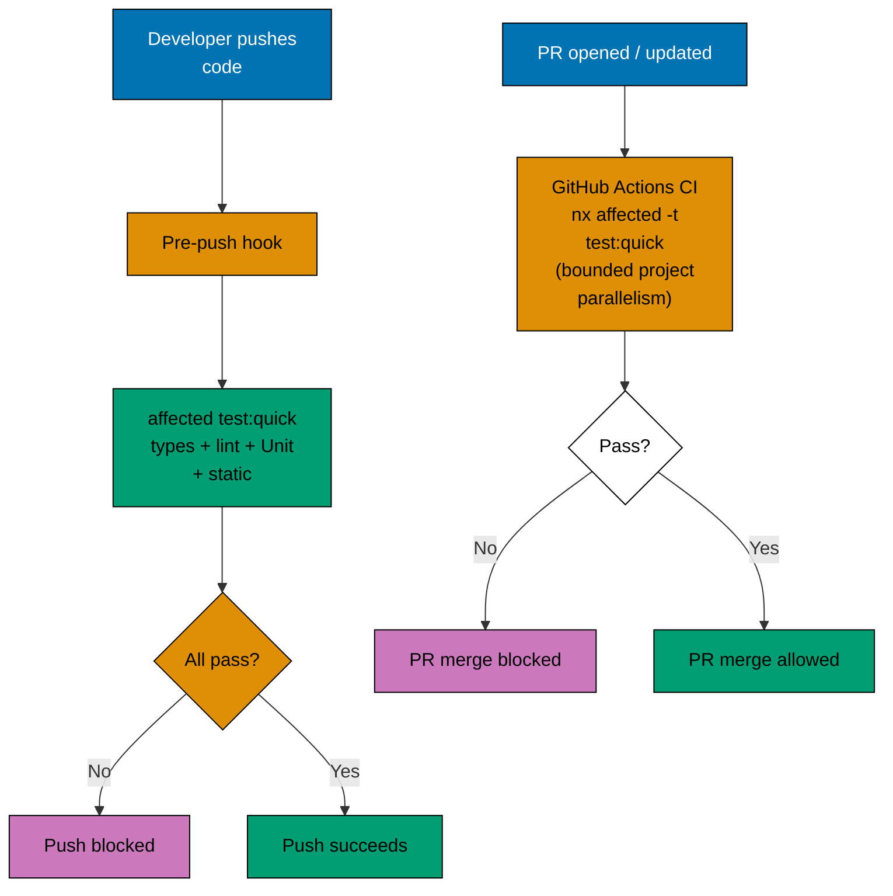
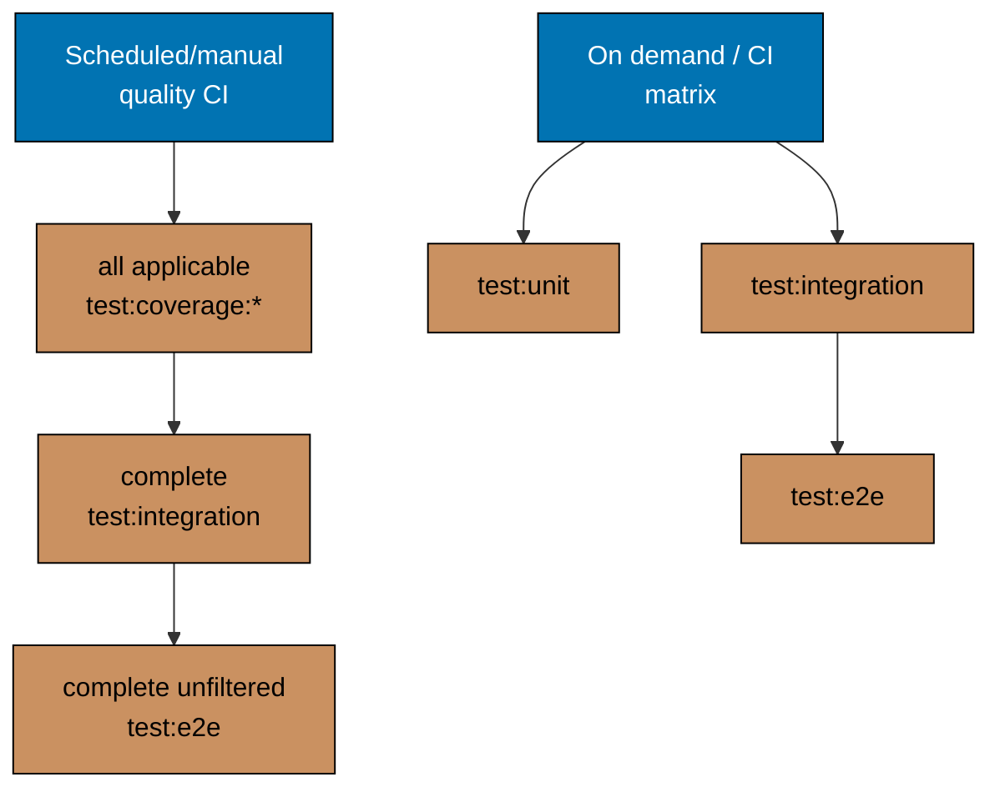

# Execution Model

## Quality Gates (pre-push enforcement)

Pre-push and PR CI execute their registry-declared projections; they are complementary lifecycle
surfaces, not three hardcoded identical checkpoints. Discover each live projection with `gate
list --surface=<surface>`. A successful PR aggregate is evidence for the exact repository, head,
and applicable base it reports; it does not prove a later head.

For behaviour owners, `test:quick` composes typecheck where applicable, lint, Unit runtime, and all
applicable static `test:coverage:*` validators. Dedicated E2E projects omit Unit runtime. Coverage
validators never execute tests; runtime code coverage belongs to its corresponding runtime target.

## Scheduled and On-Demand Testing

Deeper tests run outside the pre-push/PR cycle — on a schedule or triggered explicitly.

Developers run impacted Integration/E2E scenarios manually. Scheduled workflows run full static
coverage, then complete Integration, then complete unfiltered E2E outside the push/PR path.

