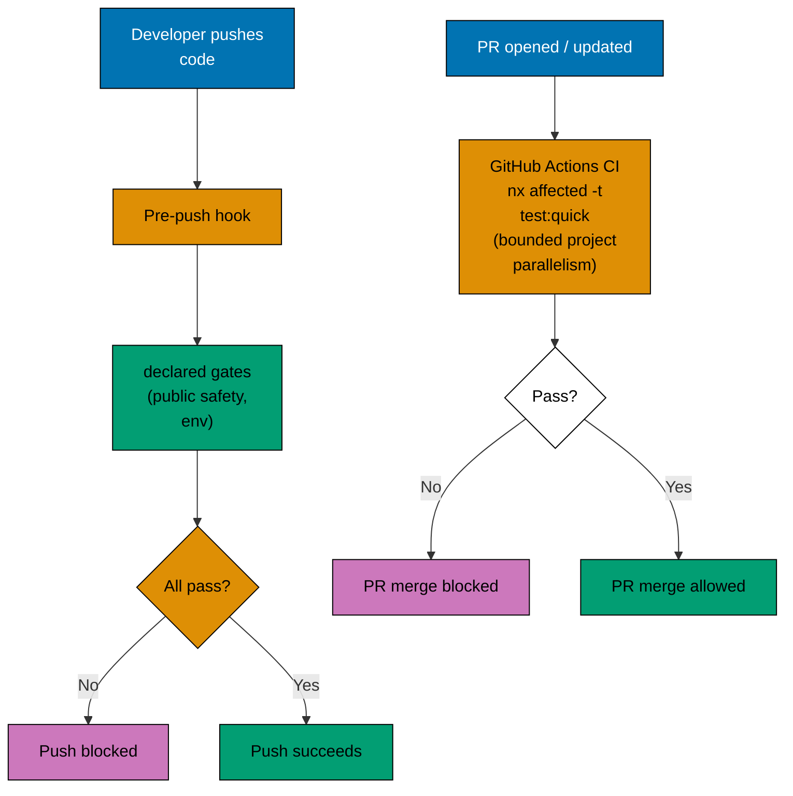
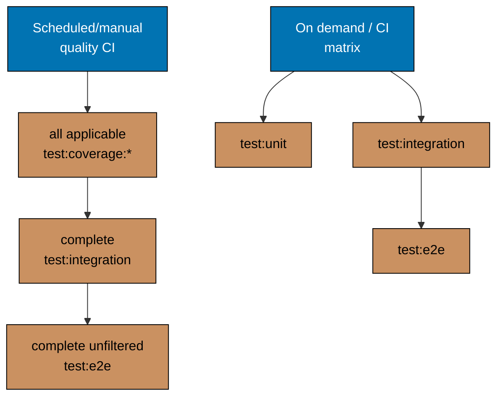

# Execution Model

## Quality Gates (PR enforcement)

The pre-push hook runs only its registry-declared gates and no Nx target; the PR workflow runs the
affected quality targets. They are complementary lifecycle surfaces, not hardcoded identical
checkpoints. Discover each live gate set with `./rhino gate list`. A successful PR aggregate is
evidence for the exact repository, head, and applicable base it reports; it does not prove a later
head.

For behaviour owners, `test:quick` composes typecheck where applicable, lint, Unit runtime, and all
applicable static `test:coverage:*` validators. Dedicated E2E projects omit Unit runtime. Coverage
validators never execute tests; runtime code coverage belongs to its corresponding runtime target.

```mermaid
flowchart TD
    accTitle: Quality Gates (PR enforcement)
    accDescr: Developer pushes code leads to Pre-push hook; Pre-push hook leads to declared gates for public safety and env; declared gates for public safety and env leads to All pass?; and 6 more links.
    A[Developer pushes<br/>code] --> B[Pre-push hook]
    B --> E["declared gates<br/>(public safety,<br/>env)"]
    E --> F{All pass?}
    F -- No --> G[Push blocked]
    F -- Yes --> H[Push succeeds]

    P[PR opened / updated] --> Q["GitHub Actions CI<br/>nx affected -t<br/>test:quick<br/>(bounded project<br/>parallelism)"]
    Q --> R{Pass?}
    R -- No --> S[PR merge blocked]
    R -- Yes --> T[PR merge allowed]

    classDef blue fill:#0173B2,stroke:#000000,color:#FFFFFF
    classDef orange fill:#DE8F05,stroke:#000000,color:#000000
    classDef teal fill:#029E73,stroke:#000000,color:#000000
    classDef purple fill:#CC78BC,stroke:#000000,color:#000000
    class A,P blue
    class B,F,Q orange
    class E,H,T teal
    class G,S purple
    classDef default fill:#FFFFFF,stroke:#000000,color:#000000
```

## Scheduled and On-Demand Testing

Deeper tests run outside the push and PR cycle — on a schedule or triggered explicitly.

Developers run impacted Integration/E2E scenarios manually. Scheduled workflows run full static
coverage, then complete Integration, then complete unfiltered E2E outside the push/PR path.

```mermaid
flowchart TD
    accTitle: Scheduled and On-Demand Testing
    accDescr: Scheduled/manual quality CI leads to all applicable test:coverage:*; all applicable test:coverage:* leads to complete test:integration; complete test:integration leads to complete unfiltered test:e2e; On demand / CI matrix leads to test:unit; and 2 more links.
    H2["Scheduled/manual<br/>quality CI"] --> C2["all applicable<br/>test:coverage:*"]
    C2 --> I2["complete<br/>test:integration"]
    I2 --> E2["complete unfiltered<br/>test:e2e"]

    J[On demand / CI<br/>matrix] --> K[test:unit]
    J --> L[test:integration]
    L --> M[test:e2e]

    classDef blue fill:#0173B2,stroke:#000000,color:#FFFFFF
    classDef brown fill:#CA9161,stroke:#000000,color:#000000
    class H2,J blue
    class C2,I2,E2,K,L,M brown
    classDef default fill:#FFFFFF,stroke:#000000,color:#000000
```
