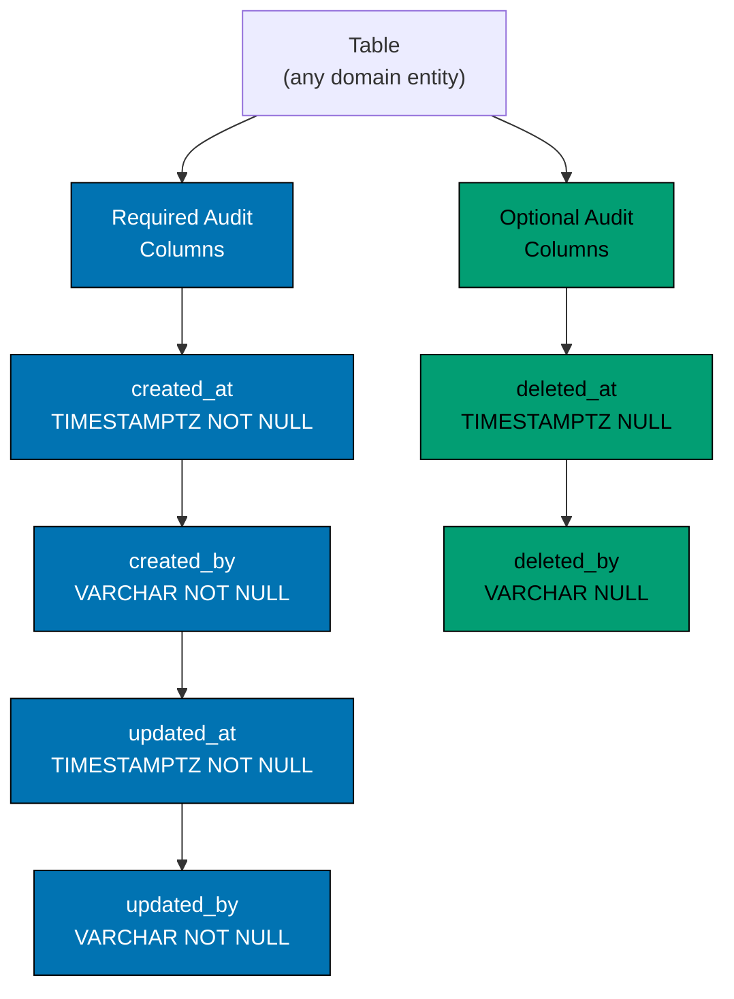

# Required Audit Columns

Every table MUST include all six columns in the order listed below.

| Column       | Type           | Nullable | Default    | Description                         |
| ------------ | -------------- | -------- | ---------- | ----------------------------------- |
| `created_at` | `TIMESTAMPTZ`  | NOT NULL | `NOW()`    | When the row was created (UTC)      |
| `created_by` | `VARCHAR(255)` | NOT NULL | `'system'` | Who or what created the row         |
| `updated_at` | `TIMESTAMPTZ`  | NOT NULL | `NOW()`    | When the row was last updated (UTC) |
| `updated_by` | `VARCHAR(255)` | NOT NULL | `'system'` | Who or what last updated the row    |
| `deleted_at` | `TIMESTAMPTZ`  | NULL     | —          | When the row was soft-deleted (UTC) |
| `deleted_by` | `VARCHAR(255)` | NULL     | —          | Who or what soft-deleted the row    |

Blue columns (required) are always non-null and populated by the database default or the calling service. Green columns (optional by value) are always present in the schema but null for active rows.
