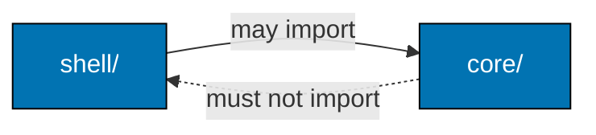

# The Dependency Rule



`core/` MUST NOT import any of: `react`, `react-dom`, `next`, `next/*`, node builtins (`fs`, `path`, `node:*`),
`@trpc/server` router/init wiring, any HTTP/DB/`fetch` client, or browser globals — not even as types. If a file under
`core/` needs one of those, it belongs in `shell/`. `core/` may import other `core/` modules (pure to pure). `shell/`
may freely import its own and sibling `core/`.

## Forbidden imports

| Zone     | Forbidden                                                                                  |
| -------- | ------------------------------------------------------------------------------------------ |
| `core/`  | `react`, `react-dom`, `next`, `next/*`, `fs`/`path`/`node:*`, `@trpc/server`, `fetch`/HTTP |
| `shell/` | Business decisions that belong in the core (extract pure logic to `core/` and call it)     |

Verify core purity with:

```bash
rg -n "from ['\"](react|react-dom|next|node:|fs|path|@trpc/server)" apps/<app>/src/features/*/core
```

This must return nothing.
