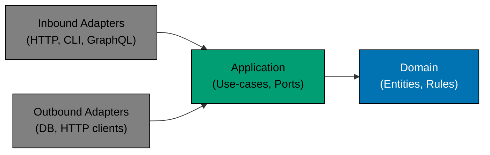

# Dependency Rule, App-Type Specializations, and Related

## Dependency Rule

Outer layers may depend on inner layers. Inner layers must never depend on outer layers. No import may cross inward
boundaries in the reverse direction.

The diagram reads left-to-right but the dependency rule applies in all directions: adapters depend on application;
application depends on domain; nothing in an inner circle imports from an outer circle.

## App-Type Specializations

Each app type in this monorepo applies the hexagonal pattern with concrete directory layouts and language-specific
idioms:

- **[CLI Apps](../hexagonal-architecture-cli.md)** — `commands/` as inbound adapter; Rust and Go CLIs
- **[Backend Apps](../hexagonal-architecture-be.md)** — DDD bounded contexts + hexagonal layers; F#/Giraffe

Next.js **web apps** deliberately do **not** use hexagonal architecture. They use the simpler two-zone
[Functional Core / Imperative Shell — Web Apps](../functional-core-imperative-shell-web.md) pattern
(`features/<name>/{core,shell}/`) instead.

## Related

- **[OpenAPI Contract-First Development](../openapi-contract-first.md)** — How the OpenAPI spec governs the API adapter
  boundary for backend services
- **[Functional Programming Practices](../functional-programming.md)** — Pure-function patterns used inside the domain
  and application layers
