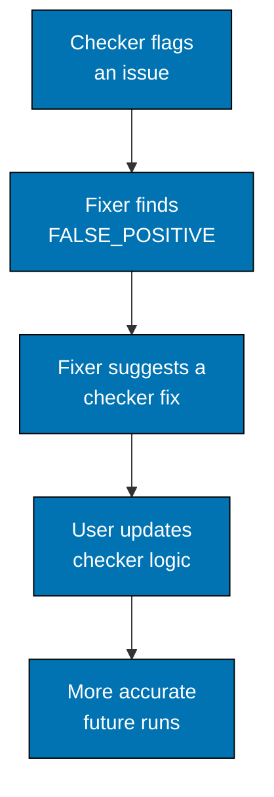

# Benefits of the Pattern

## 1. Separation of Concerns

Each agent has a **single, clear responsibility**:

- Maker focuses on **content creation** (not validation)
- Checker focuses on **validation** (not fixing)
- Fixer focuses on **remediation** (not detection)

**Result**: Agents are simpler, more maintainable, and less error-prone.

## 2. Safety Through Validation

**Problem without pattern**: Automated fixes might introduce new issues or break existing content.

**Solution with pattern**: Fixer re-validates findings before applying changes, categorizes by confidence level, and skips uncertain fixes.

**Result**: Safe, reliable automated remediation.

## 3. Audit Trail

Every validation and fix is **documented in `local-tmp/<agent-family>/`**:

- Audit reports show what was checked and what was found
- Fix reports show what was changed and why
- Users can review history and understand changes

**Result**: Transparency and accountability.

## 4. Iterative Improvement

**False Positive Feedback Loop**:

**Result**: Pattern enables continuous improvement of validation logic.

## 5. Scalability

Pattern scales across **multiple domains** without reinventing the workflow:

- Same pattern for repo rules, Next.js web content, tutorials, READMEs
- Consistent user experience across all content types
- New families can adopt pattern easily

**Result**: Standardized quality control across entire repository.
